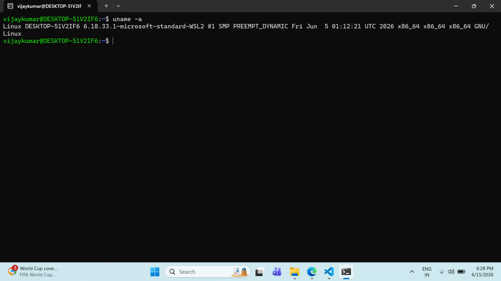
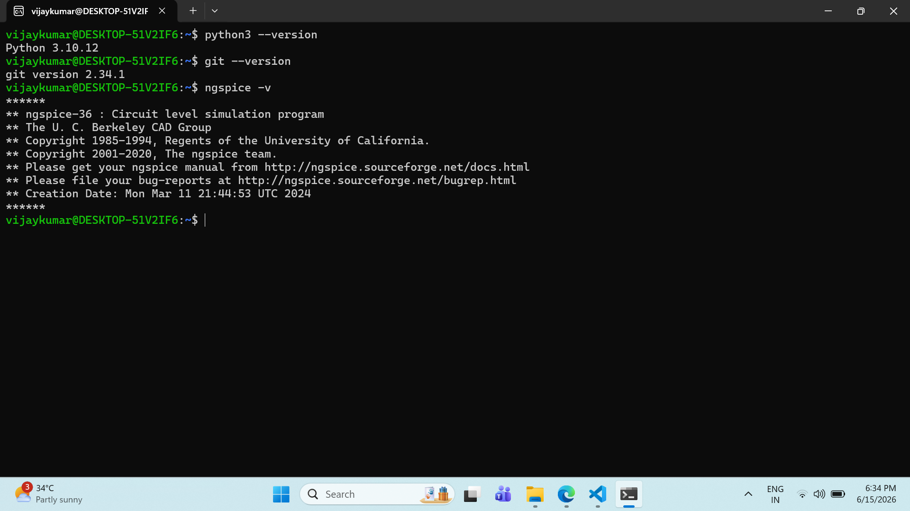
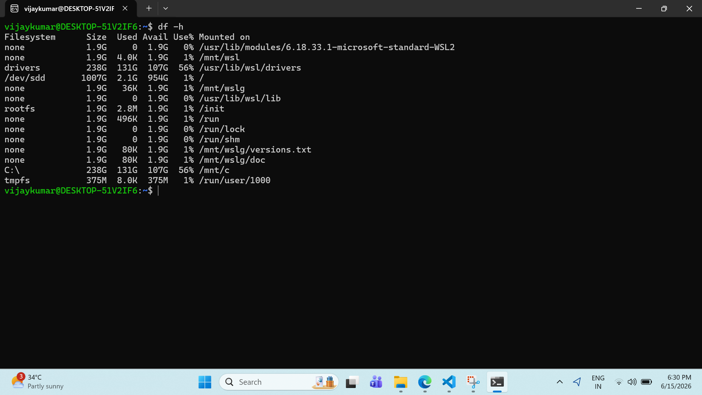
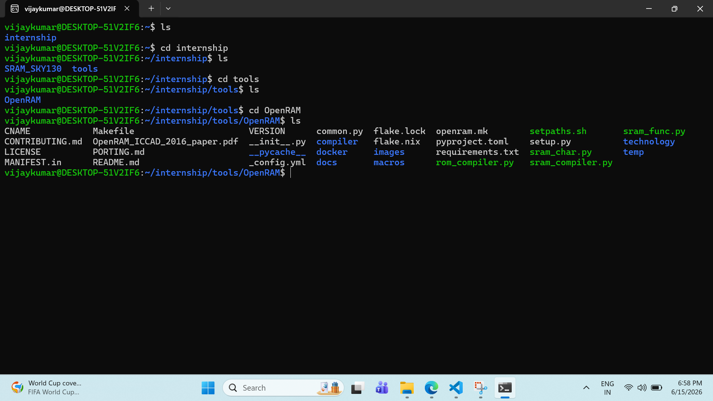
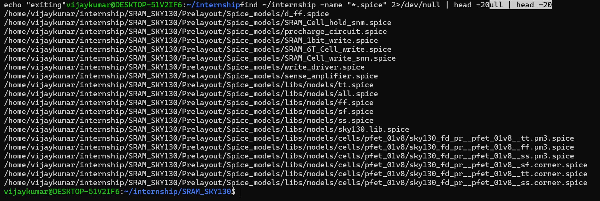

# Environment Setup

## Objective

The objective of this phase was to establish and verify an environment capable of supporting OpenRAM exploration, SRAM circuit analysis, and SPICE-based simulations using open-source EDA tools.

---

## System Configuration

| Component               | Details            |
| ----------------------- | ------------------ |
| Host Operating System   | Windows 11         |
| Linux Environment       | Ubuntu (WSL2)      |
| Development Environment | Visual Studio Code |
| Shell                   | Bash               |

### Evidence



### Observation

Ubuntu WSL was successfully configured and used as the primary environment for tool verification, repository exploration, and future simulation activities.

---

## Tool Verification

The required tools for OpenRAM investigation and SRAM circuit analysis were verified.

| Tool    | Purpose                            |
| ------- | ---------------------------------- |
| Git     | Version Control                    |
| Python3 | Scripting and OpenRAM Dependencies |
| ngspice | Circuit Simulation                 |
| xschem  | Schematic Capture                  |
| OpenRAM | SRAM Compiler Investigation        |

### Commands Used

```bash
git --version
python3 --version
ngspice -v
```

### Evidence



### Observation

All required tools were successfully verified and are available for the upcoming SRAM design and verification activities.

---

## Storage Verification

### Objective

Verify available storage before proceeding with repository setup, simulations, and documentation activities.

### Command Used

```bash
df -h
```

### Evidence



### Observation

The system provides sufficient available storage for OpenRAM repositories, simulation outputs, screenshots, and project documentation.

---

## OpenRAM Verification

### Objective

Verify the OpenRAM repository setup and investigate its directory structure.

### Evidence



### Observation

The OpenRAM repository was successfully cloned and explored. Key directories such as:

* compiler
* technology
* docs
* macros

were identified and will be investigated further during the OpenRAM Architecture phase.

---

## SKY130 Model Investigation

### Objective

Verify the availability of SKY130 technology files required for SRAM circuit simulations.

### Command Used

```bash
find ~/internship -name "*.spice"
```

### Evidence



### Observation

The investigation identified multiple SKY130 SPICE model files including:

* tt.spice
* ff.spice
* ss.spice
* sky130.lib.spice

Initially, a separate SKY130 PDK installation was expected. However, the reference repository already contains the required technology resources and SPICE model files needed for the current stage of circuit-level analysis and simulation.

---

## Key Observations

* Ubuntu WSL was successfully configured and verified.
* Required tools were available and functioning correctly.
* OpenRAM repository structure was explored successfully.
* SKY130 SPICE model files were located and verified.
* Sufficient storage was available for project activities.
* The environment is ready for SRAM architecture exploration, circuit analysis, and simulation tasks.

---

## Conclusion

The environment setup phase was completed successfully. The required tools were verified, OpenRAM was explored, and SKY130 technology resources were identified. The setup is now prepared for the next phase of the project, which focuses on understanding OpenRAM architecture and SRAM circuit building blocks.
