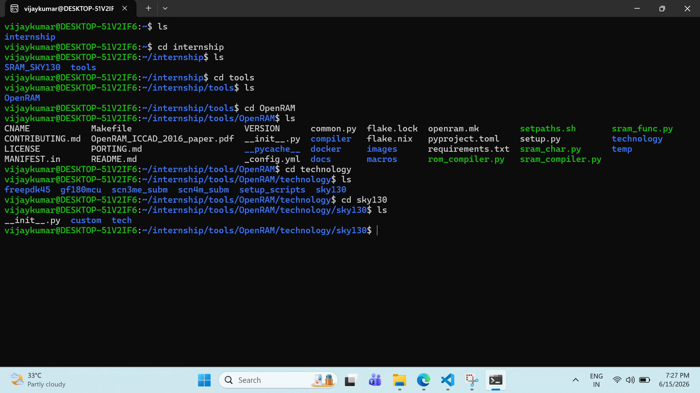
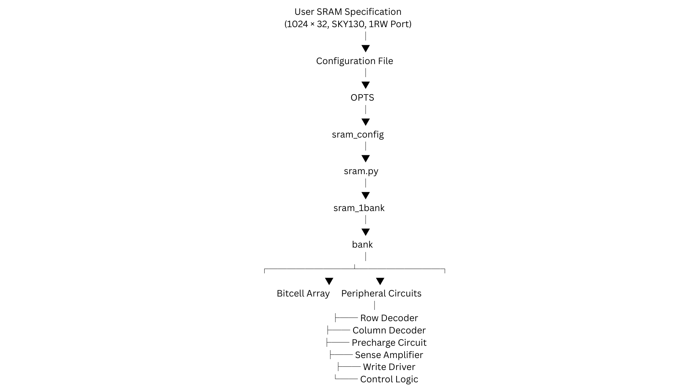
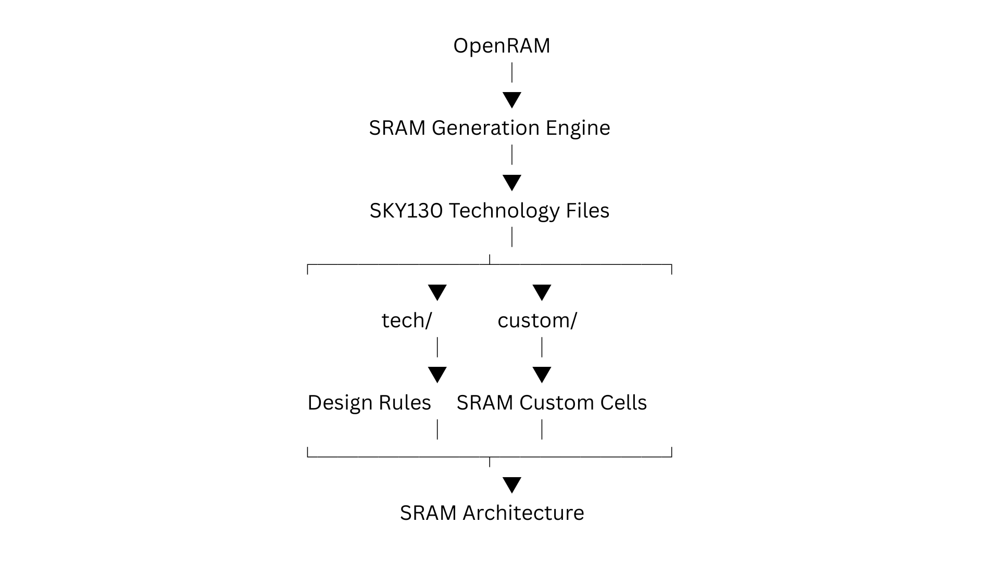

# OpenRAM Architecture

## Objective

The objective of this phase was to investigate the OpenRAM architecture and understand how user-defined memory specifications are translated into a complete SRAM design using the SKY130 technology framework.

---

## OpenRAM Overview

OpenRAM is an open-source memory compiler used to generate and characterize SRAM macros based on user-defined specifications. It provides a configurable framework that combines memory architecture generation, technology integration, characterization, and verification into a unified flow.

For this project, OpenRAM is used together with the Google SkyWater SKY130 Process Design Kit (PDK) to understand the design methodology of a 1024×32 SRAM (4 KB) memory.

---

## OpenRAM Directory Structure

### Objective

Investigate the organization of the OpenRAM repository and identify the major components involved in SRAM generation.

### Evidence



### Observation

The OpenRAM repository is organized into several functional modules.

| Directory | Purpose |
|------------|------------|
| compiler | Core SRAM generation logic |
| technology | Technology-specific files and integrations |
| docs | Documentation and reference material |
| macros | Generated SRAM macros |
| images | Repository images and visual assets |

The modular organization separates SRAM generation logic from technology-specific implementations, making OpenRAM portable across multiple process technologies.

---

## OpenRAM Compilation Flow

### Objective

Understand how OpenRAM converts user specifications into a complete SRAM architecture.

### Evidence



### Observation

The SRAM generation process follows a hierarchical architecture. The flow begins with user-defined memory specifications such as word size, number of words, number of ports, and technology selection. These specifications are processed through configuration objects and compiler modules, eventually generating a complete SRAM hierarchy consisting of memory arrays and peripheral circuits.

The generated architecture consists of:

- Bitcell Array
- Row Decoder
- Column Decoder
- Precharge Circuit
- Sense Amplifier
- Write Driver
- Control Logic

Each block performs a specific function required for SRAM read, write, addressing, sensing, and control operations.

---

## SKY130 Technology Integration

### Objective

Understand how OpenRAM incorporates SKY130 technology resources during SRAM generation.

### Evidence



### Observation

OpenRAM integrates technology-specific information through the SKY130 technology framework, enabling the generation of SRAM architectures compatible with the SkyWater 130nm process. During the investigation, the `technology/sky130` directory was explored and the major components responsible for technology integration were identified.

| Component | Function |
|------------|------------|
| `tech` | Contains technology-specific rules, SPICE models, and process parameters required for SRAM generation and simulation. |
| `custom` | Contains SRAM custom cells and technology-dependent circuit implementations used by OpenRAM. |

This separation allows OpenRAM to combine its SRAM generation engine with SKY130-specific technology resources, resulting in SRAM architectures that are compatible with the SKY130 fabrication process.

---

## Generated SRAM Hierarchy

The generated SRAM architecture follows a hierarchical organization.

```text
1024 × 32 SRAM (4 KB)
│
└── Bank
    │
    ├── Bitcell Array
    │
    └── Peripheral Circuits
        │
        ├── Row Decoder
        ├── Column Decoder
        ├── Precharge Circuit
        ├── Sense Amplifier
        ├── Write Driver
        └── Control Logic
```

The bitcell array stores the data, while the peripheral circuits handle addressing, sensing, writing, and overall memory control operations. These building blocks form the foundation of the SRAM architecture and will be analyzed individually in the upcoming phases of the project.

---

## Key Observations

- OpenRAM follows a hierarchical SRAM generation methodology.
- SRAM generation is driven by user-defined configuration parameters.
- Technology-specific resources are separated from compiler logic.
- SKY130 integration is achieved through dedicated technology and custom-cell directories.
- The generated SRAM architecture consists of a bitcell array supported by multiple peripheral circuits.
- Understanding this hierarchy is essential before analyzing individual SRAM building blocks.

---

## Conclusion

The OpenRAM architecture was successfully investigated and analyzed. The study provided insight into the repository organization, SRAM generation flow, technology integration methodology, and memory hierarchy. This understanding establishes the foundation required for the next phase of the project, which focuses on analyzing SRAM bitcells and peripheral circuit building blocks.