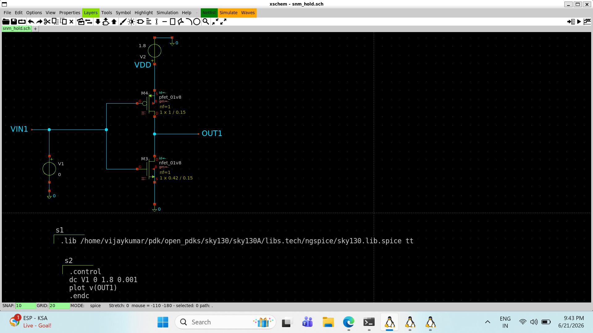
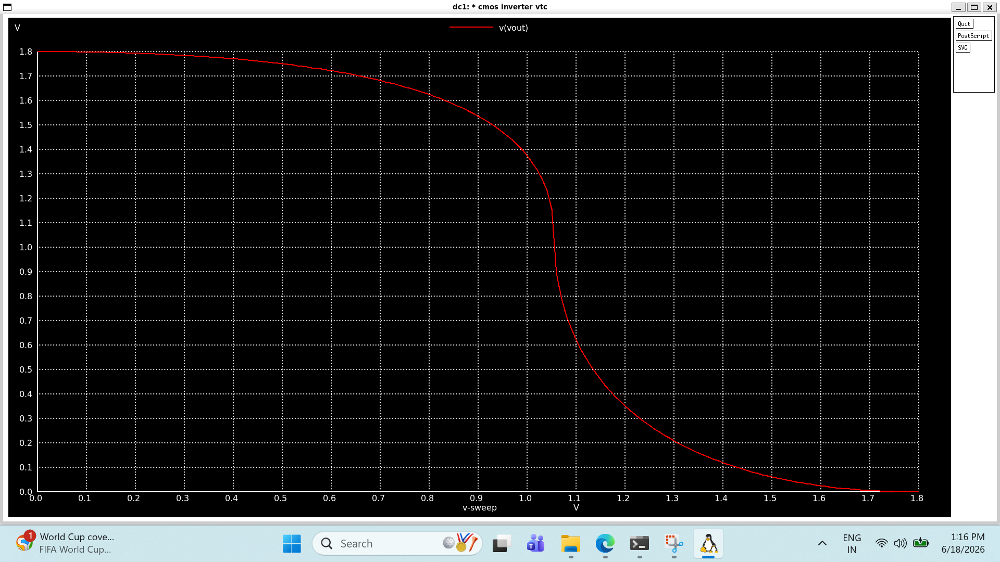

# CMOS Inverter

## Objective & Learning Approach

Study the operation of a CMOS inverter and understand how complementary PMOS and NMOS transistors implement basic digital logic. AI-assisted discussions were used to analyze the inverter at the transistor level.

---

## Key Concepts Learned

* CMOS inverter is the fundamental digital logic gate.
* Built using one PMOS and one NMOS transistor.
* Produces the logical complement of the input.
* Operates with low static power consumption.

---

## Circuit-Level Understanding

* PMOS conducts when the input is LOW.
* NMOS conducts when the input is HIGH.
* The output switches between VDD and GND based on the input state.
 ### SPICE Netlist

📄 View SPICE Netlist

[Open inverter.spice](./inverter.spice)

 CMOS Inverter Schematic

## Design Insights

* Rail-to-rail output voltage swing.
* High noise immunity.
* Forms the basic building block for SRAM cells and digital logic circuits.

---

## Observations

* Input LOW → Output HIGH.
* Input HIGH → Output LOW.
* Verified correct inverter operation through simulation.
* 
# CMOS Inverter VTC Simulation Result

---

## AI-Assisted Workflow

**Prompt Used:**
*"Explain the working of a CMOS inverter, the role of PMOS and NMOS transistors, and its switching behavior."*

**AI Model:**
ChatGPT (GPT-5.5)

---

## Next Steps

Generate the Voltage Transfer Characteristic (VTC) and analyze switching threshold, noise margins, and propagation characteristics.
