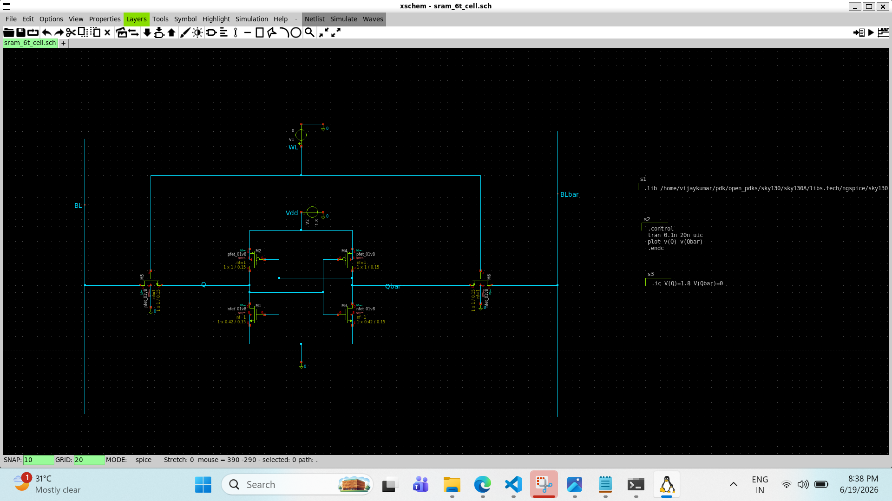

# 6T SRAM Cell

## Objective & Learning Approach

The objective of this study was to understand the architecture of a 6T SRAM bitcell and the mechanism used to store data. AI-assisted discussions were used to break the SRAM cell into smaller functional blocks and analyze its operation from a circuit-design perspective.

---

## Key Concepts Learned

* SRAM stands for Static Random Access Memory.
* Data is stored using two cross-coupled CMOS inverters.
* No refresh operation is required as long as power is supplied.
* The cell consists of:

  * 2 PMOS pull-up transistors
  * 2 NMOS pull-down transistors
  * 2 NMOS access transistors
* The storage nodes are Q and QB.

---

## Circuit-Level Understanding

The two cross-coupled inverters form a positive feedback loop that maintains the stored data.

Stable states:

* Q = 1, QB = 0
* Q = 0, QB = 1

The access transistors connect the storage nodes to the bitlines during read and write operations and isolate them during hold mode.

### SPICE Netlist

📄 View SPICE Netlist

[Open 6T_SRAM.spice](./6T-sram.spice)

### 6T_SRAM Schematic

---

## Design Insights

* The SRAM cell is a bistable circuit.
* Data is stored in the feedback relationship between the inverters rather than in an individual transistor.
* Positive feedback continuously reinforces the stored state.

---

## Observations

* Only two stable operating states exist.
* Access transistors control communication with the external circuitry.
* The SRAM cell remains stable as long as power is maintained.

---

## AI-Assisted Workflow

**Prompt Used:**
"Explain the architecture of a 6T SRAM cell, the role of each transistor, and how positive feedback enables data storage."

**AI Model:**
ChatGPT (GPT-5.5)

---

## Next Steps

Study hold operation and analyze transistor-level behavior when the wordline is disabled.
