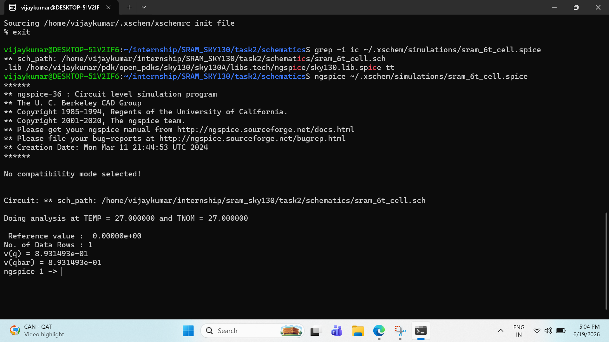
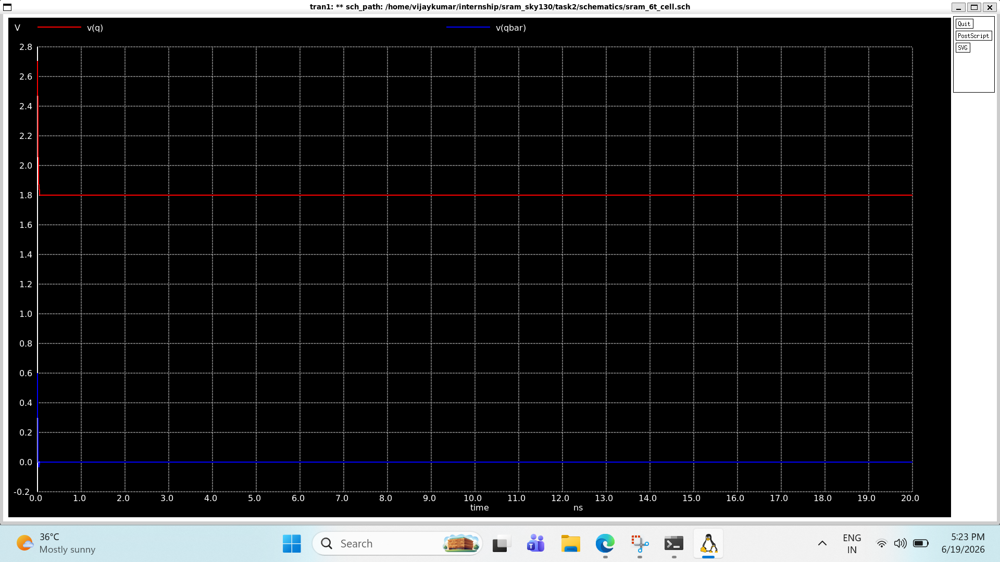

# Hold Operation

## Objective & Learning Approach

The objective of this study was to understand how a 6T SRAM cell retains data when no read or write operation is being performed. AI-assisted discussions were used to analyze transistor-level behavior, stable operating states, and the role of positive feedback during hold mode.

---

## Key Concepts Learned

* Hold mode occurs when the wordline (WL) is LOW.
* Access transistors remain OFF during hold operation.
* The storage nodes are isolated from the bitlines.
* The stored data is preserved by the cross-coupled inverters.
* No external circuitry influences the cell during this mode.

---

## Circuit-Level Understanding

During hold mode:

* WL = 0
* Access transistors are OFF
* BL and BLB are disconnected from the storage nodes

The cross-coupled inverters continuously reinforce each other through positive feedback.

Example stable states:

* Q = 1, QB = 0
* Q = 0, QB = 1

These states remain stable as long as power is supplied.

---

## Design Insights

* Hold mode is the default operating state of an SRAM cell.
* Positive feedback continuously restores small disturbances.
* Data retention depends on inverter stability rather than external refresh circuitry.

---

## Observations

* The cell behaves as a bistable latch.
* Small voltage disturbances are corrected through regenerative feedback.
* The access transistors provide electrical isolation from the bitlines.
### Hold_operation_simulation_output

---

## AI-Assisted Workflow

**Prompt Used:**
"Explain hold operation in a 6T SRAM cell and analyze transistor-level behavior when WL is LOW."

**AI Model:**
ChatGPT (GPT-5.5)

---

## Next Steps

Study the SRAM read operation and understand how data is sensed through the bitlines without corrupting the stored value.
