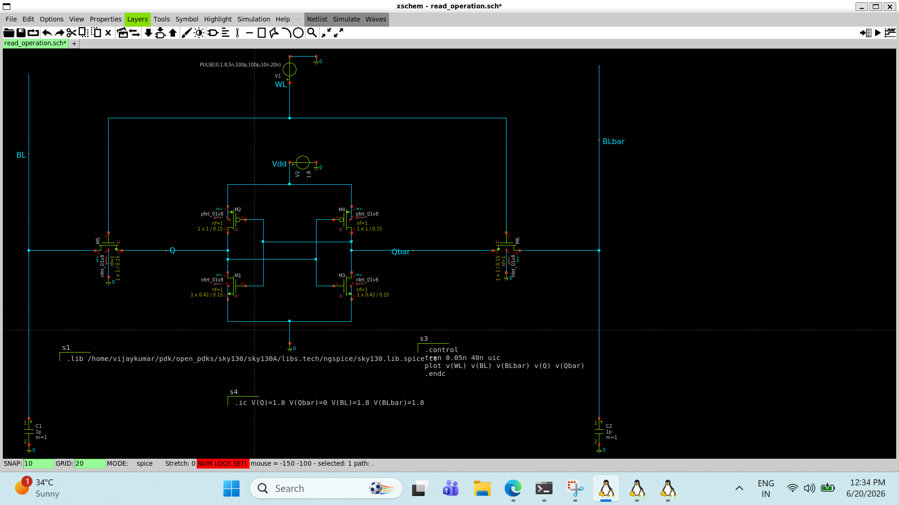
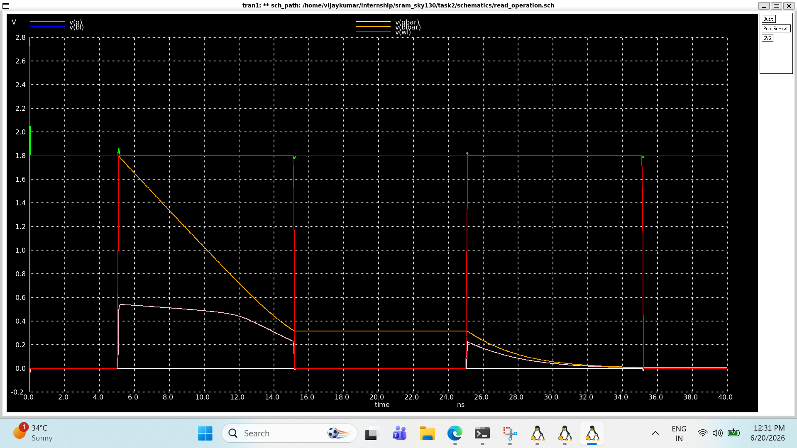

# Read Operation

## Objective & Learning Approach

The objective of this study was to understand how stored data is retrieved from a 6T SRAM cell. AI-assisted discussions were used to analyze bitline precharge, wordline activation, differential sensing, and the development of read voltage differences.

---

## Key Concepts Learned

* Read operation begins with bitline precharge.
* Both BL and BLB are initially charged to VDD.
* The wordline enables the access transistors.
* One bitline remains near VDD while the other begins to discharge.
* Data is sensed using differential voltage development.

---

## Circuit-Level Understanding

Read sequence:

1. Precharge BL and BLB to VDD.
2. Assert WL.
3. Access transistors turn ON.
4. Depending on the stored value, one bitline develops a discharge path.
5. A small differential voltage is generated.
6. The sense amplifier detects the differential and produces the output.

Example:

For:

* Q = 1
* QB = 0

BLB begins discharging while BL remains near VDD.

### SPICE Netlist

📄 View SPICE Netlist

[Open read_operation.spice](./read_operation_netlist.spice)

### Read_operation  Schematic

---

## Design Insights

* SRAM read operation relies on voltage differences rather than full logic swings.
* Differential sensing improves speed and noise immunity.
* Precharge ensures consistent initial conditions before every read.

---

## Observations

* The memory cell does not directly drive a bitline to ground.
* Only a small differential voltage is required for successful sensing.
* Read operation temporarily connects internal storage nodes to the bitlines.
*
### Read_operation  result

---

---

## AI-Assisted Workflow

**Prompt Used:**
"Explain the read operation of a 6T SRAM cell including precharge, bitline behavior, and differential sensing."

**AI Model:**
ChatGPT (GPT-5.5)

---

## Next Steps

Investigate read disturb and analyze how the read operation can affect cell stability.
