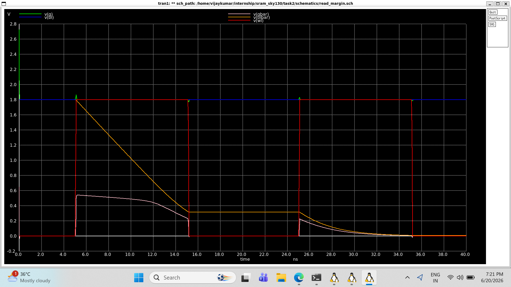
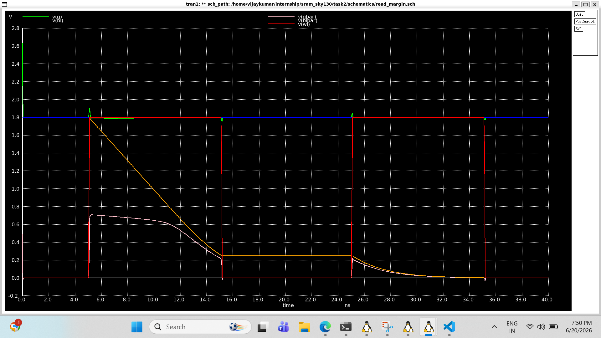
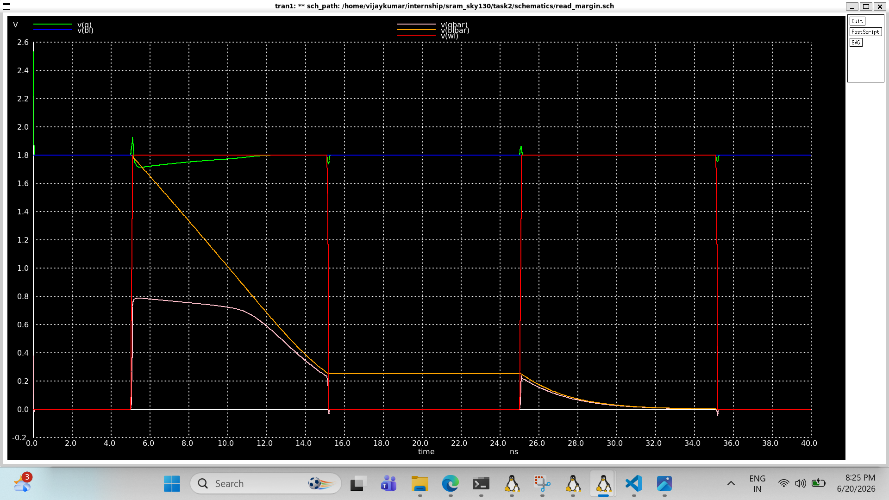
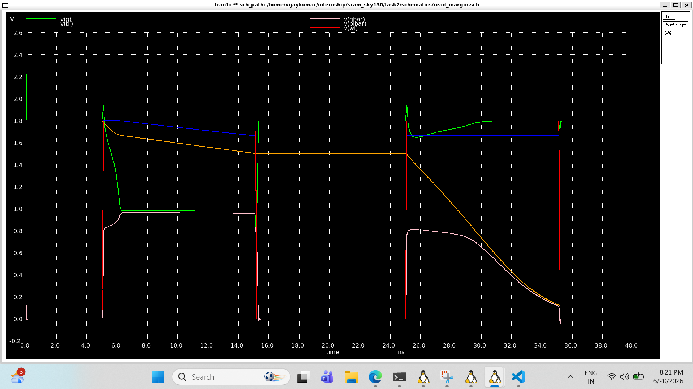

# Read Margin Analysis

## Objective

The objective of this study was to investigate the read stability of a 6T SRAM cell and understand how the access transistor strength affects the internal node disturbance during a read operation.

Unlike read disturb analysis, which observes the disturbance under nominal sizing, read margin analysis intentionally increases the access transistor strength to determine the point at which the stored data becomes unstable.

---

## Simulation Setup

### Initial Conditions

```spice
.ic V(Q)=1.8 V
.ic V(Qbar)=0
.ic V(BL)=1.8
.ic V(BLbar)=1.8
```

### Supply Voltage

```text
VDD = 1.8 V
```

### Wordline Pulse

```text
WL : PULSE(0 1.8 5n 100p 100p 10n 20n)
```

### Bitline Capacitances

```text
CBL  = 1 pF
CBLbar = 1 pF
```

### Pull-Down NMOS Size

```text
W = 0.42 μm
L = 0.15 μm
```

Only the access transistor width (M5 and M6) was varied.

---

# Case 1 : Baseline

## Access Transistor Size

```text
W = 1 μm
L = 0.15 μm
```

## Observation

- Q remained close to 1.8 V.
- Qbar experienced a small disturbance (~0.5 V).
- The cell restored itself after the wordline was disabled.

### Simulation Result

<p align="center">

</p>
✔ Stable


---

# Case 2 : Increased Access Strength

## Access Transistor Size

```text
W = 1.5 μm
L = 0.15 μm
```

## Observation

- Qbar disturbance increased to approximately 0.65 V.
- Q remained almost unchanged.
- Cell recovered after the read operation.

### Simulation Result

<p align="center">

</p>
✔ Stable

---

# Case 3 : Stronger Access Transistors

## Access Transistor Size

```text
W = 2 μm
L = 0.15 μm
```

## Observation

- Qbar disturbance increased further (~0.7 V).
- Read operation remained successful.
- No read upset occurred.

### Simulation Result

<p align="center">

</p>
✔ Stable

---

# Case 4 : Near Read Failure Boundary

## Access Transistor Size

```text
W = 3 μm
L = 0.15 μm
```

## Observation

- Qbar rose to approximately 0.78 V.
- Q experienced noticeable degradation.
- Cell successfully restored its state.

### Simulation Result

<p align="center">

</p>
✔ Stable


---

# Case 5 : Read Margin Exhaustion

## Access Transistor Size

```text
W = 4 μm
L = 0.15 μm
```

## Observation

- Q dropped from 1.8 V to approximately 1 V.
- Qbar rose to nearly 1 V.
- Both storage nodes approached equal voltages.
- The cell operated very close to the read failure boundary.

This demonstrates that excessively strong access transistors can significantly degrade read stability.

## Result
### Simulation Result

<p align="center">

</p>
⚠ Near Read Failure


---

# Comparison of Cases

| Case | Access Width (μm) | Peak Qbar | Cell Stability |
|--------|----------------|------------|----------------|
| Case 1 | 1 | ~0.5 V | Stable |
| Case 2 | 1.5 | ~0.65 V | Stable |
| Case 3 | 2 | ~0.7 V | Stable |
| Case 4 | 3 | ~0.78 V | Stable |
| Case 5 | 4 | ~1 V | Near Failure |

---

# Practical Insights

Increasing the access transistor strength improves bitline discharge speed and read performance. However, stronger access transistors disturb the internal storage nodes more severely, reducing the read margin.

This experiment demonstrates the fundamental tradeoff between:

```text
Read Speed ↔ Read Stability
```

and highlights the importance of transistor sizing in SRAM design.

---

# Key Takeaways

- Read margin depends strongly on the ratio between pull-down and access transistor strengths.
- Stronger access transistors increase internal node disturbance.
- Excessively large access transistors can drive the cell towards read failure.
- Proper transistor sizing is essential for reliable SRAM operation.

---

## AI-Assisted Workflow

### Prompt Used

> Explain the concept of read margin in a 6T SRAM cell and describe how increasing access transistor strength affects read stability.

### AI Model

ChatGPT (GPT-5.5)

---

## Next Steps

- Inverter VTC Simulation
- Butterfly Curve Generation
- Static Noise Margin (SNM) Analysis
