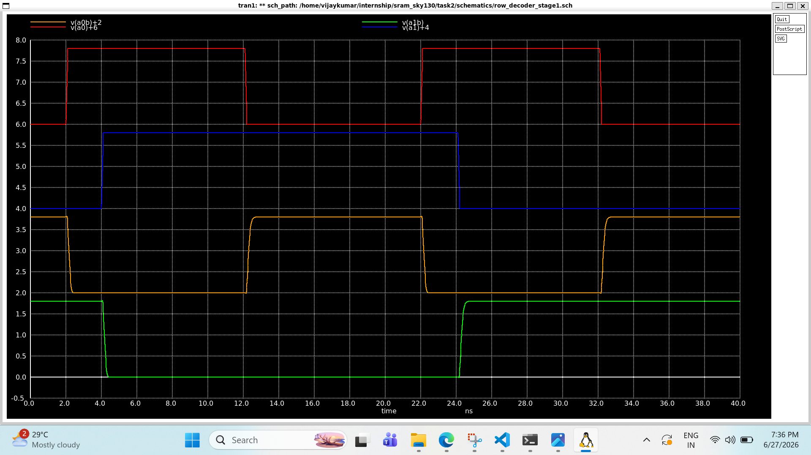
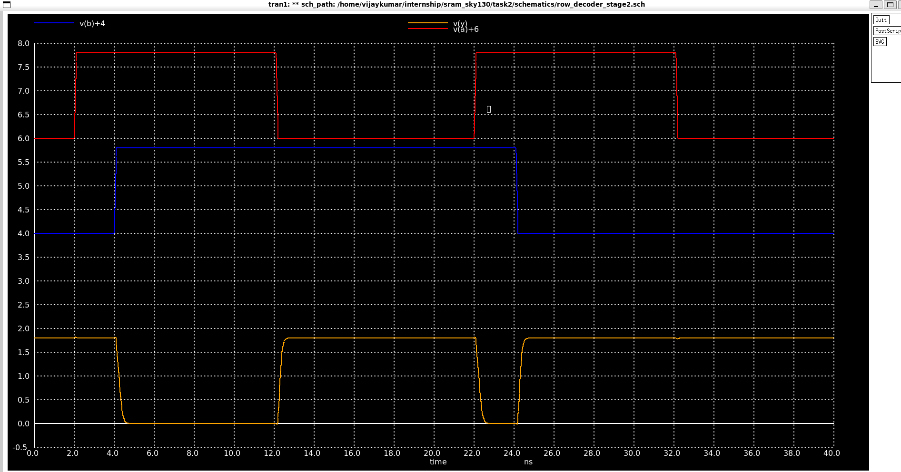
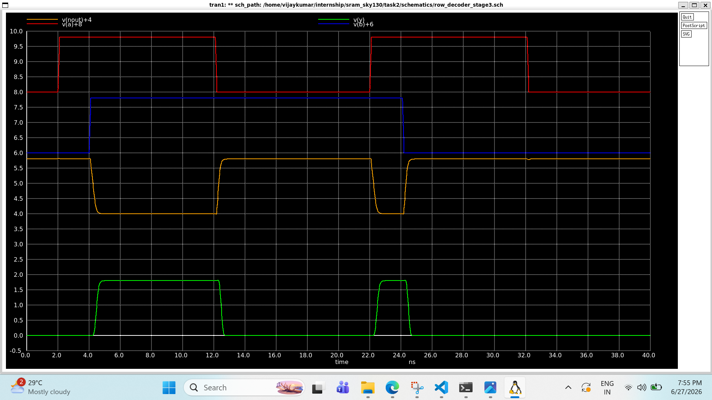
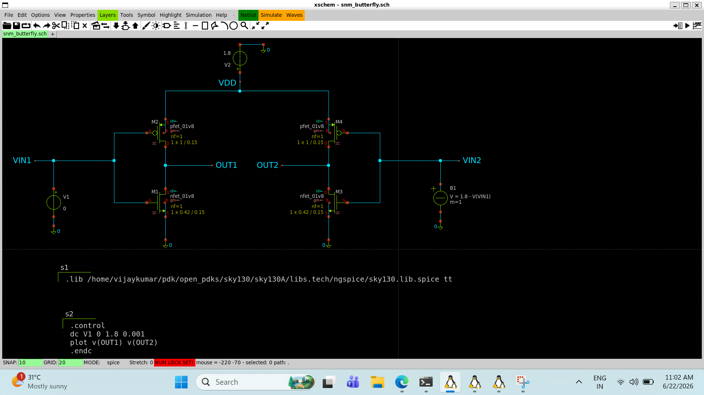
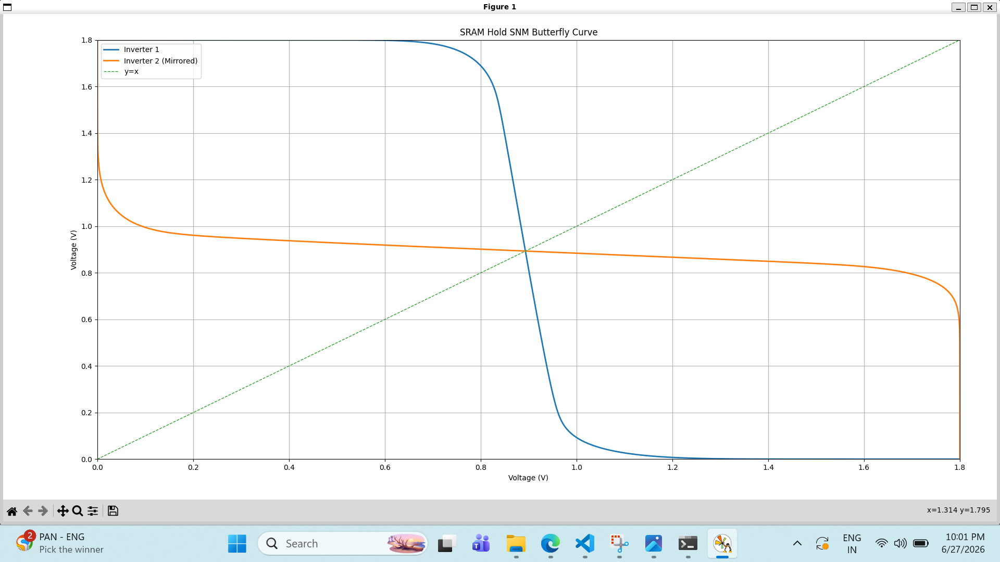
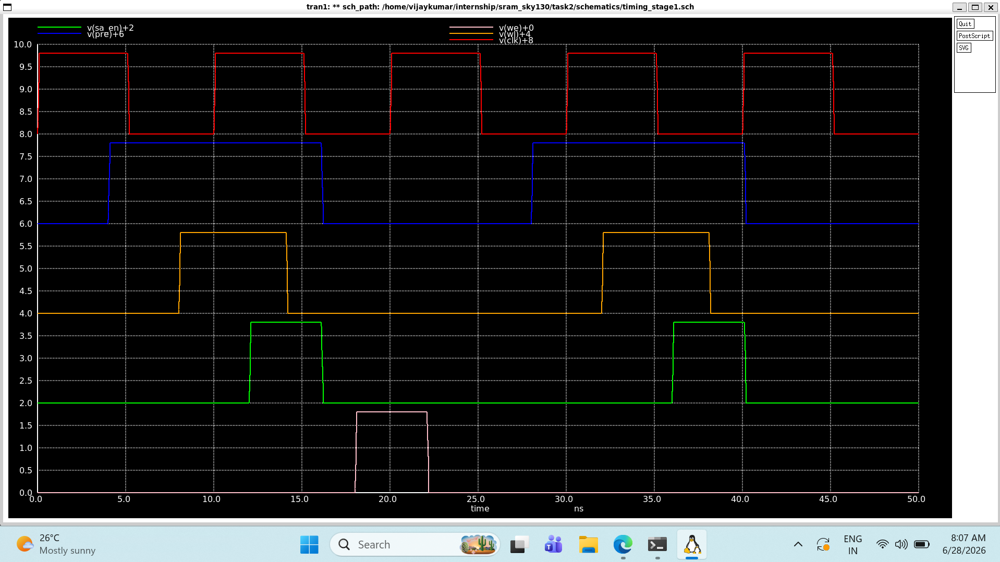

# AI_Assisted_Research_Workflow

## Objective

Document the AI-assisted engineering workflow followed during Task 2 of the SRAM IP Design internship, including prompt engineering, research, generated SPICE/netlists, debugging iterations, simulation validation, and engineering observations.

---

## Understanding the Task

The objective of Task 2 was carefully analyzed before continuing the remaining SRAM peripheral circuit implementations.

The task description emphasized the following requirements:

* Use AI tools for circuit exploration and research.
* Generate low-token prompts for circuit design.
* Generate SPICE/netlist examples.
* Validate generated circuits using Xschem, NGSpice and SKY130 models.
* Document AI prompts, generated netlists, simulation attempts, debugging process, fixes, waveforms and engineering observations.
* Focus on individual SRAM circuit blocks instead of the complete OpenRAM compiler flow or full SRAM macro implementation.

### Prompt Used to Establish the Workflow

The following prompt was used to understand the actual expectation of the task and define a practical implementation strategy.

> I have already completed several SRAM circuit blocks using Xschem and NGSpice, but I have not documented the AI prompts, generated netlists, simulation attempts, debugging process or engineering observations. The remaining tasks include Wordline Control, Bitline Behaviour, Sense Amplifier, Write Driver, Row/Column Decoder Basics and SRAM Timing Sequence.
>
> Analyze the Task 2 requirements carefully and determine whether the expectation is to design every circuit completely from scratch or to perform AI-assisted research, generate SPICE/netlist examples, validate them using Xschem and NGSpice, document the engineering workflow, and build a reproducible development process. Based on the task requirements, propose a practical workflow that satisfies the internship objectives while maintaining proper engineering validation.

### Outcome

After analyzing the task requirements, the following workflow was adopted.

Research

↓

Reference Circuit Study

↓

Prompt Engineering

↓

AI Generated SPICE / Netlist

↓

Manual Review

↓

Xschem Implementation

↓

NGSpice Simulation

↓

Waveform Validation

↓

Debugging (if required)

↓

Documentation

---

## Initial Stage

Before introducing this workflow, several SRAM circuit blocks had already been implemented and verified using Xschem and NGSpice.

Available:

* Circuit schematics
* Simulation outputs
* Waveforms
* Experimental results

Missing:

* AI prompts
* Prompt refinements
* Generated SPICE/netlists
* Research notes
* Debugging iterations
* Engineering observations

This workflow was introduced to document those engineering artifacts while continuing the remaining Task 2 implementations.

---

## Engineering Workflow

The workflow documented in this directory is applied to the remaining SRAM peripheral circuit implementations.

For every circuit, AI is used for research, prompt engineering and initial SPICE generation, while the final implementation is manually reviewed, validated in Xschem and NGSpice, and supported with simulation evidence and concise engineering observations.
# Wordline Driver

## Objective

Design and validate a two-stage CMOS Wordline Driver using SKY130 devices while establishing a reusable AI-assisted workflow for SRAM peripheral circuit development.

---

# Initial AI Prompt

```text
Design a two-stage CMOS wordline driver for an SRAM using SKY130 devices.

Requirements:

- Use sky130_fd_pr__nfet_01v8 and sky130_fd_pr__pfet_01v8
- VDD = 1.8 V
- Generate an NGSpice compatible SPICE netlist
- Use two cascaded CMOS inverters
- Include transient simulation
- Generate a netlist compatible with Xschem hierarchy
- Do not rename device instances or nodes unnecessarily.
```

---

# Initial AI Generated Netlist

The initial SPICE netlist was generated directly from the AI prompt before validating compatibility with the local SKY130 PDK.

## SPICE Netlist

<details>
<summary>📄 View Initial AI Generated Netlist</summary>

[`spice_netlist/initial_wordline_driver_netlist.spice`](spice_netlist/initial_wordline_driver_netlist.spice)

</details>

---

# Error

```text
could not find a valid modelname
Simulation interrupted due to error.
```

---

# Debugging Workflow

### Verify NGSpice Installation

**Command**

```bash
ngspice -v
```

Confirmed:

```text
ngspice-36
```

---

### Verify SKY130 Library Path

**Command**

```bash
find ~ -name "sky130.lib.spice"
```

Selected Library

```text
/ home/vijaykumar/pdk/open_pdks/sky130/sky130A/libs.tech/ngspice/sky130.lib.spice
```

---

### Verify SKY130 Model Availability

**Command**

```bash
grep -R "nfet_01v8" \
/home/vijaykumar/pdk/open_pdks/sky130/sky130A/libs.tech/ngspice/ | head -30
```

The required SKY130 NMOS and PMOS models were present in the installed PDK.

---

# Root Cause

The AI-generated netlist used a transistor/model invocation style that was incompatible with the locally installed SKY130 PDK.

Comparison with a previously verified Xschem-generated SRAM netlist confirmed that the issue was related to transistor instantiation syntax rather than missing models or an incorrect library path.

---

# Updated Netlist

The following engineering changes were applied before regenerating the netlist:

- Updated the verified SKY130 library path.
- Matched the transistor instantiation syntax generated by Xschem.
- Preserved SKY130 device names.
- Reused the verified SPICE structure from an existing working netlist.

## SPICE Netlist

<details>
<summary>📄 View Updated Wordline Driver Netlist</summary>

[`spice_netlist/wordline_driver.spice`](spice_netlist/wordline_driver.spice)

</details>

---

# NGSpice Result

<p align="center">

</p>

### Observation

- DIN switches between 0 V and 1.8 V.
- N1 generates the complementary intermediate signal.
- WL restores the original logic level after the second inverter.
- Two-stage CMOS Wordline Driver verified successfully.
# Bitline Behaviour

## Objective

Design and simulate the bitline behaviour of a 6T SRAM cell during a read operation and observe the differential voltage developed on BL and BLB.

---

# Initial AI Prompt

```text
Design a transistor-level SPICE circuit to demonstrate SRAM Bitline Behaviour during a read operation using SKY130 devices.

Requirements:

- Use a single 6T SRAM cell.
- Include BL and BLB capacitive loads.
- Drive the Wordline using a pulse source.
- Precharge both bitlines to VDD.
- Use SKY130 1.8 V MOSFET devices.
- Generate an NGSpice-compatible SPICE netlist.
- Include transient analysis.
- Plot WL, BL, BLB, Q and Qbar.
- Use the verified SKY130 library path.
```

---

# Initial AI Generated Netlist

## SPICE Netlist

<details>
<summary>📄 View Initial AI Generated Netlist</summary>

[`spice_netlist/initial_bitline_behaviour_netlist.spice`](spice_netlist/initial_bitline_behaviour_netlist.spice)

</details>

---

## Initial Observation

- Simulation completed successfully.
- Excessive discharge observed on both bitlines.
- Differential bitline behaviour was not achieved.

---

# Debugging Workflow

## Root Cause

The bitlines floated after initialization because no precharge circuitry was included.

## Engineering Changes

- Added PMOS precharge transistors.
- Added PRE control signal.
- Reduced bitline capacitance.
- Updated the transient setup to include the precharge phase.

---

# Updated Netlist

## SPICE Netlist

<details>
<summary>📄 View Updated Bitline Behaviour Netlist</summary>

[`spice_netlist/bitline_behavior.spice`](spice_netlist/bitline_behaviour.spice)

</details>

---

# NGSpice Result

## Initial Simulation Output

<p align="center">

</p>

### Observation

- SRAM cell operated correctly.
- Both bitlines discharged excessively.
- Differential voltage was not clearly observed.

---

## Updated Simulation Output

<p align="center">

</p>

### Observation

- Bitlines were successfully precharged.
- Wordline activated after precharge release.
- Differential bitline behaviour observed.
- Stored cell data remained stable during the read operation.
* # Write Driver

## Objective

Design and verify a CMOS SRAM Write Driver using an incremental implementation approach.

---

# AI Prompt

```text
Design a transistor-level CMOS SRAM Write Driver using SKY130 devices.

Requirements:

- Use sky130_fd_pr__nfet_01v8 and sky130_fd_pr__pfet_01v8
- VDD = 1.8 V
- Generate complementary outputs BL and BLB.
- Include Write Enable (WR_EN).
- Generate an NGSpice compatible SPICE netlist.
- Use the verified SKY130 library path.
- Include transient analysis.
- Plot DIN, WR_EN, BL and BLB.
```

---

# Stage 1 — Complementary Data Generator

### Netlist

> *(Paste the Stage 1 SPICE netlist here.)*

### NGSpice Result

`simulation_results/write_driver_stage1.png`

<p align="center">

</p>

### Observation

- DINB successfully generated.
- Rail-to-rail logic levels achieved.
- Stage 1 verified.

---

# Stage 2 — Complete Write Driver

### Netlist

> *(Paste the complete Write Driver SPICE netlist here.)*
> # Write Driver

## Objective

Design and verify a CMOS SRAM Write Driver using an incremental implementation approach.

---

# AI Prompt

```text
Design a transistor-level CMOS SRAM Write Driver using SKY130 devices.

Requirements:

- Use sky130_fd_pr__nfet_01v8 and sky130_fd_pr__pfet_01v8
- VDD = 1.8 V
- Generate complementary outputs BL and BLB.
- Include Write Enable (WR_EN).
- Generate an NGSpice compatible SPICE netlist.
- Use the verified SKY130 library path.
- Include transient analysis.
- Plot DIN, WR_EN, BL and BLB.
```

---

# Stage 1 — Complementary Data Generator

## SPICE Netlist

<details>
<summary>📄 View Stage 1 SPICE Netlist</summary>

[`spice_netlist/write_driver_stage1.spice`](spice_netlist/write_driver_stage1.spice)

</details>

---

## NGSpice Result

<p align="center">

</p>

### Observation

- DINB successfully generated.
- Rail-to-rail logic levels achieved.
- Stage 1 functionality verified.

---

# Stage 2 — Complete Write Driver

## SPICE Netlist

<details>
<summary>📄 View Complete Write Driver SPICE Netlist</summary>

[`spice_netlist/write_driver.spice`](spice_netlist/write_driver.spice)

</details>

---

## NGSpice Result

<p align="center">

</p>

### Observation

- WR_EN successfully controlled the write operation.
- BL and BLB generated complementary outputs.
- Complementary write operation verified.
- Complete CMOS Write Driver successfully implemented.

# Sense Amplifier

## Objective

Design and verify a latch-based SRAM Sense Amplifier using SKY130 devices. The implementation was developed incrementally by first validating the regenerative latch and then integrating the Sense Enable (SA_EN) signal.

---

## AI Prompt

```text
Design a latch-type SRAM Sense Amplifier using SKY130 devices.

Requirements:

- Use sky130_fd_pr__nfet_01v8 and sky130_fd_pr__pfet_01v8
- VDD = 1.8 V
- Differential inputs: BL and BLB
- Differential outputs: OUT and OUTB
- Include a Sense Enable (SA_EN) signal
- Generate an NGSpice compatible SPICE netlist
- Use the verified SKY130 library path
- Include transient analysis
- Plot BL, BLB, SA_EN, OUT and OUTB
```

---

# Stage 1 – Regenerative Latch Verification

## SPICE Netlist

<details>
<summary>📄 View Stage 1 SPICE Netlist</summary>

[`spice_netlist/sense_amplifier_stage1.spice`](spice_netlist/sense_amplifier_stage1.spice)

</details>

---

## NGSpice Result

<p align="center">

</p>

### Observation

- Cross-coupled regenerative latch verified.
- BL and BLB differential successfully detected.
- OUT and OUTB resolve to complementary logic levels.
- Stage 1 latch functionality validated.

---

# Stage 2 – Sense Enable Integration

## SPICE Netlist

<details>
<summary>📄 View Stage 2 SPICE Netlist</summary>

[`spice_netlist/sense_amplifier.spice`](spice_netlist/sense_amplifier.spice)

</details>

---

## NGSpice Result

<p align="center">

</p>

### Observation

- Sense operation is enabled through SA_EN.
- Small BL/BLB differential is amplified into full logic levels.
- Complementary outputs remain stable during the sensing window.
- Functional latch-type SRAM Sense Amplifier successfully verified.
- # Row Decoder

## Objective

Design and verify the building blocks of a CMOS 2-to-4 SRAM Row Decoder using SKY130 devices through an incremental, transistor-level implementation approach.

---

# AI Prompt

```text
Design a transistor-level CMOS 2-to-4 SRAM Row Decoder using SKY130 devices.

Requirements:

- Use sky130_fd_pr__nfet_01v8 and sky130_fd_pr__pfet_01v8
- VDD = 1.8 V
- Generate complementary address signals.
- Implement CMOS NAND and AND logic.
- Decode two address inputs into four wordlines.
- Use the verified SKY130 library path.
- Generate an NGSpice-compatible SPICE netlist.
- Include transient analysis.
```

---

# Stage 1 — Address Inverters

### SPICE Netlist

<details>
<summary>📄 View Stage 1 Netlist</summary>

[Row Decoder Stage 1 Netlist](spice_netlist/row_decoder_stage1.spice)

</details>

### NGSpice Result

`simulation_results/row_decoder_stage1.png`

<p align="center">

</p>

### Observation

- Complementary address signals generated.
- Rail-to-rail logic verified.
- Stage 1 successfully validated.

---

# Stage 2 — CMOS NAND Gate

### SPICE Netlist

<details>
<summary>📄 View Stage 2 Netlist</summary>


[Row Decoder Stage 2 Netlist](spice_netlist/row_decoder_stage2.spice)

</details>

### NGSpice Result

`simulation_results/row_decoder_stage2.png`

<p align="center">

</p>

### Observation

- CMOS NAND operation verified.
- Correct pull-up and pull-down paths observed.
- Output matches NAND logic.

---

# Stage 3 — CMOS AND Gate

### SPICE Netlist

<details>
<summary>📄 View Stage 3 Netlist</summary>

[Row Decoder Stage 3 Netlist](spice_netlist/row_decoder_stage3.spice)

</details>

### NGSpice Result

`simulation_results/row_decoder_stage3.png`

<p align="center">

</p>

### Observation

- AND function implemented using CMOS NAND + Inverter.
- Full rail-to-rail output achieved.
- Stage 3 successfully validated.

---

# Research & Debugging

## Problem Encountered

The complete decoder was initially implemented using behavioral voltage sources with `if()` expressions.

```spice
BWL0 WL0 0 V=if(...)
```

NGSpice returned:

```text
Error: no such function 'if'
Simulation interrupted due to error.
```

### Root Cause

- `if()` expressions are not supported in this NGSpice implementation.
- The generated approach relied on behavioral modeling instead of transistor-level CMOS logic.

### Resolution

Instead of behavioral logic, the decoder was redesigned hierarchically by verifying each CMOS building block independently:

- Stage 1 — Address Inverters
- Stage 2 — CMOS NAND Gate
- Stage 3 — CMOS AND Gate

These verified subcircuits can be hierarchically instantiated to construct the complete 2-to-4 CMOS Row Decoder.
# Hold Static Noise Margin (Hold SNM)

## Objective

Analyze the Hold Static Noise Margin (Hold SNM) of a 6T SRAM cell by generating the inverter VTC and establishing a Python-based butterfly curve generation workflow.

---

# Initial AI Prompt

```text
Design a transistor-level Hold SNM analysis for a 6T SRAM cell using SKY130 technology.

Requirements:

- Operate the SRAM cell in Hold mode.
- Disable the Wordline.
- Perform a DC sweep.
- Generate the inverter VTC.
- Export simulation data.
- Generate the Butterfly Curve using Python.
- Maintain NGSpice compatibility.
```

---

# Research Goal

Generate the inverter VTC and develop a reusable NGSpice-to-Python workflow for Hold SNM analysis.

---

### SPICE Netlist

<details>
<summary>📄 View Hold SNM Netlist</summary>

[snm_hold.spice](spice_netlist/snm_hold.spice)

</details>

---

# Hold SNM Schematic

[snm_butterfly_schematic.png](simulation_results/snm_butterrfly_schematic.png)

<p align="center">

</p>

### Observation

* Configured the 6T SRAM cell in Hold mode.
* Performed DC sweep for inverter VTC generation.
* Exported simulation data for post-processing.

---

# Hold SNM Butterfly Curve

`simulation_results/hold_snm_butterfly_curve.png`

<p align="center">

</p>

### Observation

* Imported the NGSpice CSV data into Python.
* Generated the mirrored inverter characteristic.
* Successfully produced the Hold SNM butterfly curve.
* Established a reusable workflow for future Read and Write SNM analysis.

---

# Research Challenges

* NGSpice CSV export formatting.
* Python package compatibility (NumPy, Pandas, Matplotlib).
* CSV parsing and preprocessing.
* Butterfly curve generation using mirrored VTC data.
* # SRAM Timing Sequence

## Objective

Design and verify the control timing sequence required for SRAM read and write operations by generating the essential control signals in the correct order.

---

## Key Signals

- **CLK** – System clock
- **PRE** – Precharge enable
- **WL** – Wordline enable
- **SA_EN** – Sense amplifier enable
- **WE** – Write enable

---

## Timing Sequence

1. Precharge the bitlines.
2. Enable the selected wordline.
3. Perform Read or Write operation.
4. Enable the Sense Amplifier for read.
5. Disable all control signals and prepare for the next cycle.

---

## SPICE Implementation

### SPICE Netlist

<details>
<summary>📄 View Timing Stage Netlist</summary>

[Open timing_stage1.spice](./spice_netlist/timing_stage1.spice)

</details>

---

## Simulation Result

<p align="center">

</p>

---

## Observations

- Generated all SRAM control signals successfully.
- Verified the correct activation sequence of **PRE → WL → SA_EN → WE**.
- Established the timing framework for complete SRAM integration.

---

## AI-Assisted Workflow

**Prompt Used:**

> *Design and verify the timing sequence for an SRAM read/write operation using NGSpice by generating CLK, PRE, WL, SA_EN and WE signals.*

**AI Model:**  
ChatGPT (GPT-5.5)

---

## Next Steps

Integrate the timing controller with the SRAM cell and peripheral circuits to verify complete SRAM read and write operations.

---

# Research Summary

| Aspect | Approach |
|--------|----------|
| Research Method | AI-assisted iterative design and verification |
| Development Flow | Learn → Design → Simulate → Debug → Verify → Document |
| Verification | NGSpice transient/DC simulation with waveform validation |
| Optimization | Modular SPICE netlists, reusable subcircuits, standardized node naming |
| AI Usage | Concept learning, circuit design, debugging, documentation |
| Outcome | Successfully verified the implementation and documented the design workflow for future SRAM integration. |
