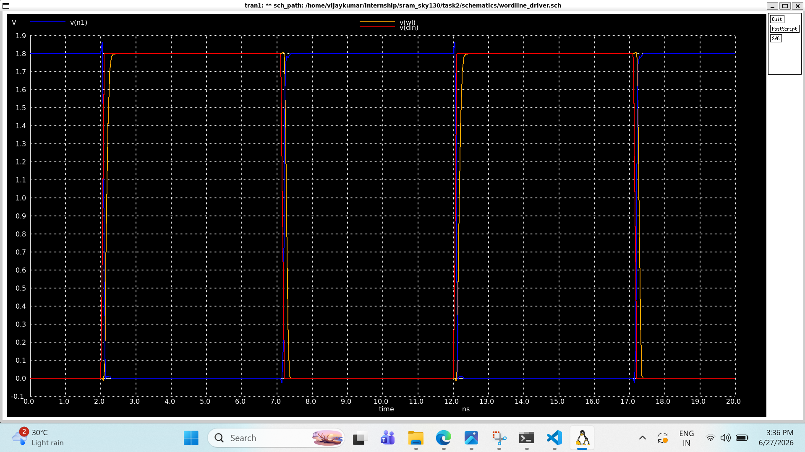
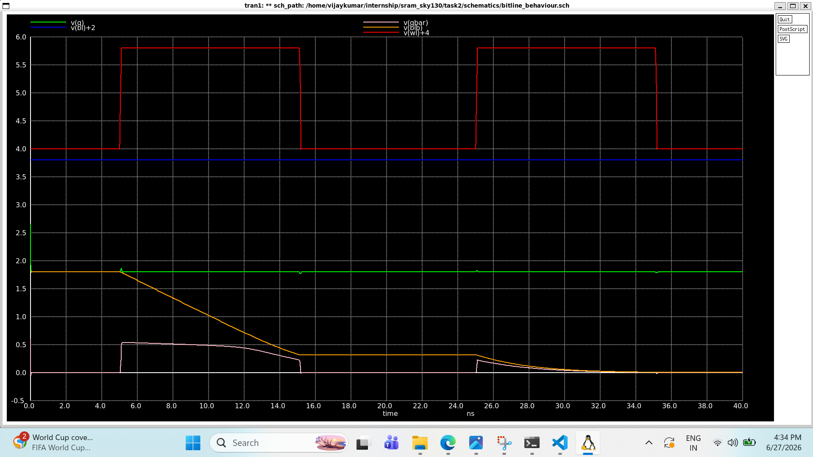
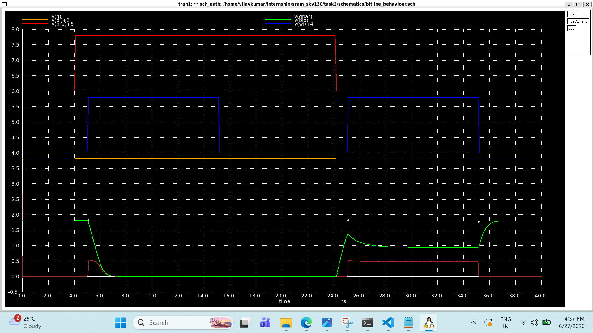
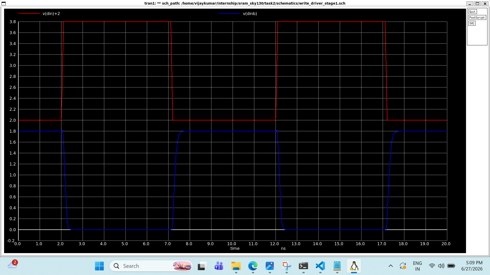
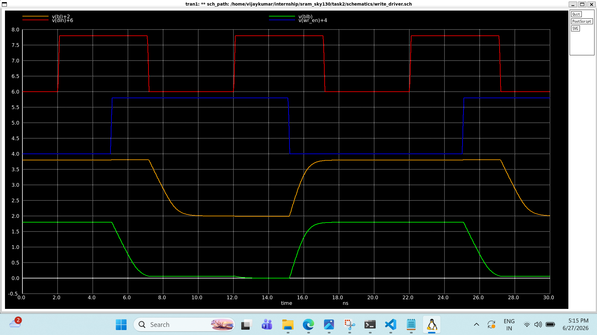
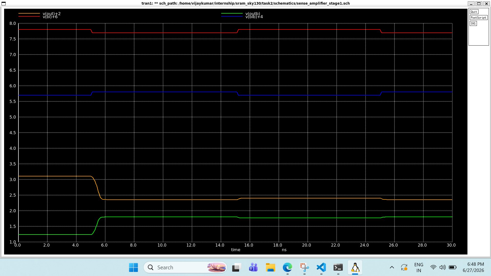

# AI_Assisted_Research_Workflow

## Objective

Document the AI-assisted engineering workflow followed during Task 2 of the SRAM IP Design internship, including prompt engineering, research, generated SPICE/netlists, debugging iterations, simulation validation, and engineering observations.

---

## Understanding the Task

The objective of Task 2 was carefully analyzed before continuing the remaining SRAM peripheral circuit implementations.

The task description emphasized the following requirements:

* Use AI tools for circuit exploration and research.
* Generate low-token prompts for circuit design.
* Generate SPICE/netlist examples.
* Validate generated circuits using Xschem, NGSpice and SKY130 models.
* Document AI prompts, generated netlists, simulation attempts, debugging process, fixes, waveforms and engineering observations.
* Focus on individual SRAM circuit blocks instead of the complete OpenRAM compiler flow or full SRAM macro implementation.

### Prompt Used to Establish the Workflow

The following prompt was used to understand the actual expectation of the task and define a practical implementation strategy.

> I have already completed several SRAM circuit blocks using Xschem and NGSpice, but I have not documented the AI prompts, generated netlists, simulation attempts, debugging process or engineering observations. The remaining tasks include Wordline Control, Bitline Behaviour, Sense Amplifier, Write Driver, Row/Column Decoder Basics and SRAM Timing Sequence.
>
> Analyze the Task 2 requirements carefully and determine whether the expectation is to design every circuit completely from scratch or to perform AI-assisted research, generate SPICE/netlist examples, validate them using Xschem and NGSpice, document the engineering workflow, and build a reproducible development process. Based on the task requirements, propose a practical workflow that satisfies the internship objectives while maintaining proper engineering validation.

### Outcome

After analyzing the task requirements, the following workflow was adopted.

Research

↓

Reference Circuit Study

↓

Prompt Engineering

↓

AI Generated SPICE / Netlist

↓

Manual Review

↓

Xschem Implementation

↓

NGSpice Simulation

↓

Waveform Validation

↓

Debugging (if required)

↓

Documentation

---

## Initial Stage

Before introducing this workflow, several SRAM circuit blocks had already been implemented and verified using Xschem and NGSpice.

Available:

* Circuit schematics
* Simulation outputs
* Waveforms
* Experimental results

Missing:

* AI prompts
* Prompt refinements
* Generated SPICE/netlists
* Research notes
* Debugging iterations
* Engineering observations

This workflow was introduced to document those engineering artifacts while continuing the remaining Task 2 implementations.

---

## Engineering Workflow

The workflow documented in this directory is applied to the remaining SRAM peripheral circuit implementations.

For every circuit, AI is used for research, prompt engineering and initial SPICE generation, while the final implementation is manually reviewed, validated in Xschem and NGSpice, and supported with simulation evidence and concise engineering observations.
# Wordline Driver

## Objective

Design and validate a two-stage CMOS Wordline Driver using SKY130 devices while establishing a reusable AI-assisted workflow for SRAM peripheral circuit development.

---

# Initial AI Prompt

```text
Design a two-stage CMOS wordline driver for an SRAM using SKY130 devices.

Requirements:

- Use sky130_fd_pr__nfet_01v8 and sky130_fd_pr__pfet_01v8
- VDD = 1.8 V
- Generate an NGSpice compatible SPICE netlist
- Use two cascaded CMOS inverters
- Include transient simulation
- Generate a netlist compatible with Xschem hierarchy
- Do not rename device instances or nodes unnecessarily.
```

---

# Initial AI Generated Netlist

The first AI-generated SPICE netlist was created directly from the prompt without considering the exact SKY130 PDK implementation available in the local environment.

>
> *-----------------------------------------------------------
>
> * Two-Stage CMOS Wordline Driver (SKY130)
>   *-----------------------------------------------------------
>
> .lib "./libs.tech/ngspice/sky130.lib.spice" tt
>
> *-----------------------------
>
> * Stage 1 Inverter
>   *-----------------------------
>   XM1 n1 din gnd gnd sky130_fd_pr__nfet_01v8 w=0.42 l=0.15
>   XM2 n1 din vdd vdd sky130_fd_pr__pfet_01v8 w=0.84 l=0.15
>
> *-----------------------------
>
> * Stage 2 Inverter (Larger Drive)
>   *-----------------------------
>   XM3 wl n1 gnd gnd sky130_fd_pr__nfet_01v8 w=0.84 l=0.15
>   XM4 wl n1 vdd vdd sky130_fd_pr__pfet_01v8 w=1.68 l=0.15
>
> *-----------------------------------------------------------
>
> * Power Supply
>   *-----------------------------------------------------------
>
> VDD vdd gnd DC 1.8
>
> *-----------------------------------------------------------
>
> * Input Stimulus
>   *-----------------------------------------------------------
>
> VIN din gnd PULSE(
> +0
> +1.8
> +1n
> +50p
> +50p
> +5n
> +10n)
>
> *-----------------------------------------------------------
>
> * Output Load
>   *-----------------------------------------------------------
>
> CWL wl gnd 20f
>
> *-----------------------------------------------------------
>
> * Simulation
>   *-----------------------------------------------------------
>
> .tran 10p 20n
>
> .control
> run
> plot v(din)+2.5 v(n1)+1.2 v(wl)
> .endc
>
> .end
>
> *generated netlist here.)*

---

# Error

```text
could not find a valid modelname
Simulation interrupted due to error.
```

---

# Debugging Workflow

### Verify NGSpice Installation

**Command**

```bash
ngspice -v
```

Confirmed:

```text
ngspice-36
```

---

### Verify SKY130 Library Path

**Command**

```bash
find ~ -name "sky130.lib.spice"
```

Selected Library

```text
/home/vijaykumar/pdk/open_pdks/sky130/sky130A/libs.tech/ngspice/sky130.lib.spice
```

---

### Verify SKY130 Model Availability

**Command**

```bash
grep -R "nfet_01v8" \
/home/vijaykumar/pdk/open_pdks/sky130/sky130A/libs.tech/ngspice/ | head -30
```

The required SKY130 NMOS and PMOS models were present in the installed PDK.

---

# Root Cause

The AI-generated netlist used a transistor/model invocation style that was incompatible with the locally installed SKY130 PDK.

Comparison with a previously verified Xschem-generated SRAM netlist confirmed that the issue was related to the transistor instantiation syntax rather than missing models or an incorrect library path.

---

# Updated Netlist

The following changes were applied before regenerating the netlist:

* Updated the SKY130 library path.
* Matched the transistor instantiation syntax used by Xschem.
* Preserved the SKY130 device names.
* Reused the verified SPICE structure from an existing working netlist.

** sch_path: /home/vijaykumar/internship/SRAM_SKY130/task2/schematics/wordline_driver.sch
**.subckt wordline_driver

---

* First Stage CMOS Inverter

---

XM1 N1 DIN 0 0 sky130_fd_pr__nfet_01v8 L=0.15 W=0.42
XM2 N1 DIN Vdd Vdd sky130_fd_pr__pfet_01v8 L=0.15 W=1

---

* Second Stage CMOS Inverter

---

XM3 WL N1 0 0 sky130_fd_pr__nfet_01v8 L=0.15 W=0.84
XM4 WL N1 Vdd Vdd sky130_fd_pr__pfet_01v8 L=0.15 W=2

---

* Supply

---

V1 DIN 0 PULSE(0 1.8 2n 100p 100p 5n 10n)

V2 Vdd 0 1.8

---

* Wordline Load

---

C1 WL 0 20f

**** begin user architecture code

.lib /home/vijaykumar/pdk/open_pdks/sky130/sky130A/libs.tech/ngspice/sky130.lib.spice tt

.control

tran 0.05n 20n

plot v(DIN) v(N1) v(WL)

.endc

**** end user architecture code

.end

---

## NGSpice Result

**Waveform**

`simulation_results/wordline_driver_output_waveform.png`



### Observation

* DIN switches between 0 V and 1.8 V.
* N1 generates the complementary intermediate signal.
* WL restores the original logic level after the second inverter.
* The propagation delay between DIN and WL confirms correct operation of the two-stage CMOS Wordline Driver.

---

# Engineering Outcome

This debugging process established a reusable workflow for future SRAM peripheral circuits:

* Generate the initial AI netlist.
* Validate it using NGSpice.
* Verify the local SKY130 library and model availability.
* Compare with a working Xschem-generated reference when compatibility issues arise.
* Update the netlist to match the local PDK syntax.
* Re-simulate and verify the generated waveforms before documenting the implementation.
# Bitline Behaviour

## Objective

Design and simulate the bitline behaviour of a 6T SRAM cell during a read operation and observe the voltage difference developed on BL and BLB.

---

# Initial AI Prompt

```text
Design a transistor-level SPICE circuit to demonstrate SRAM Bitline Behaviour during a read operation using SKY130 devices.

Requirements:

- Use a single 6T SRAM cell.
- Include BL and BLB capacitive loads.
- Drive the Wordline using a pulse source.
- Precharge both bitlines to VDD.
- Use SKY130 1.8 V MOSFET devices.
- Generate an NGSpice-compatible SPICE netlist.
- Include transient analysis.
- Plot WL, BL, BLB, Q and Qbar.
- Use the verified SKY130 library path.
```

---

# Initial AI Generated Netlist

> *(Past*
>
> ** sch_path: /home/vijaykumar/internship/SRAM_SKY130/task2/schematics/bitline_behaviour.sch
> **.subckt bitline_behaviour
>
> ---
>
> * 6T SRAM Cell
>
> ---
>
> XM1 Q    Qbar   0    0    sky130_fd_pr__nfet_01v8 L=0.15 W=0.42
> XM2 Q    Qbar   Vdd  Vdd  sky130_fd_pr__pfet_01v8 L=0.15 W=1
>
> XM3 Qbar Q      0    0    sky130_fd_pr__nfet_01v8 L=0.15 W=0.42
> XM4 Qbar Q      Vdd  Vdd  sky130_fd_pr__pfet_01v8 L=0.15 W=1
>
> ---
>
> * Access Transistors
>
> ---
>
> XM5 BL   WL     Q     0    sky130_fd_pr__nfet_01v8 L=0.15 W=1
> XM6 BLB  WL     Qbar  0    sky130_fd_pr__nfet_01v8 L=0.15 W=1
>
> ---
>
> * Wordline Pulse
>
> ---
>
> VWL WL 0 PULSE(0 1.8 5n 100p 100p 10n 20n)
>
> ---
>
> * Supply
>
> ---
>
> VVDD Vdd 0 1.8
>
> ---
>
> * Bitline Capacitances
>
> ---
>
> CBL  BL  0 1p
> CBLB BLB 0 1p
>
> **** begin user architecture code
>
> .lib /home/vijaykumar/pdk/open_pdks/sky130/sky130A/libs.tech/ngspice/sky130.lib.spice tt
>
> .control
>
> tran 0.05n 40n uic
>
> plot v(WL)+4 v(BL)+2 v(BLB) v(Q) v(Qbar)
>
> .endc
>
> ---
>
> * Initial Conditions
>
> ---
>
> .ic V(Q)=1.8
> .ic V(Qbar)=0
> .ic V(BL)=1.8
> .ic V(BLB)=1.8
>
> **** end user architecture code
>
> .end

---

# Initial Observation

* Simulation completed successfully.
* Excessive discharge was observed on both bitlines.
* Expected differential bitline behaviour was not achieved.

---

# Debugging Workflow

### Root Cause

The bitlines were floating after initialization because no precharge circuitry was present.

### Improvements

* Added PMOS precharge transistors.
* Added PRE control signal.
* Reduced bitline capacitance.
* Updated transient waveform to include PRE.

---

# Updated Netlist

> *(*
>
> ** sch_path: /home/vijaykumar/internship/SRAM_SKY130/task2/schematics/bitline_behaviour.sch
> **.subckt bitline_behaviour
>
> ---
>
> * 6T SRAM CELL
>
> ---
>
> XM1 Q    Qbar   0    0    sky130_fd_pr__nfet_01v8 L=0.15 W=0.42
> XM2 Q    Qbar   Vdd  Vdd  sky130_fd_pr__pfet_01v8 L=0.15 W=1
>
> XM3 Qbar Q      0    0    sky130_fd_pr__nfet_01v8 L=0.15 W=0.42
> XM4 Qbar Q      Vdd  Vdd  sky130_fd_pr__pfet_01v8 L=0.15 W=1
>
> ---
>
> * ACCESS TRANSISTORS
>
> ---
>
> XM5 BL   WL   Q     0    sky130_fd_pr__nfet_01v8 L=0.15 W=1
> XM6 BLB  WL   Qbar  0    sky130_fd_pr__nfet_01v8 L=0.15 W=1
>
> ---
>
> * PRECHARGE CIRCUIT
>
> ---
>
> XM7 BL   PRE  Vdd Vdd sky130_fd_pr__pfet_01v8 L=0.15 W=1
> XM8 BLB  PRE  Vdd Vdd sky130_fd_pr__pfet_01v8 L=0.15 W=1
>
> ---
>
> * POWER SUPPLY
>
> ---
>
> VVDD Vdd 0 1.8
>
> ---
>
> * WORDLINE
>
> ---
>
> VWL WL 0 PULSE(
> +0
> +1.8
> +5n
> +100p
> +100p
> +10n
> +20n)
>
> ---
>
> * PRECHARGE CONTROL
> * PRE = 0  -> Precharge ON
> * PRE = 1.8 -> Precharge OFF
>
> ---
>
> VPRE PRE 0 PULSE(
> +0
> +1.8
> +4n
> +100p
> +100p
> +20n
> +40n)
>
> ---
>
> * BITLINE CAPACITANCE
>
> ---
>
> CBL  BL   0 100f
> CBLB BLB  0 100f
>
> ---
>
> * USER ARCHITECTURE
>
> ---
>
> .lib /home/vijaykumar/pdk/open_pdks/sky130/sky130A/libs.tech/ngspice/sky130.lib.spice tt
>
> .control
>
> tran 0.02n 40n uic
>
> plot v(PRE)+6 v(WL)+4 v(BL)+2 v(BLB) v(Q) v(Qbar)
>
> .endc
>
> ---
>
> * INITIAL CONDITIONS
>
> ---
>
> .ic V(Q)=1.8
> .ic V(Qbar)=0
> .ic V(BL)=1.8
> .ic V(BLB)=1.8
>
> ---
>
> .end

---

# NGSpice Result

## Initial Simulation Output

`simulation_results/bitline_behaviour_initial_simulation_output.png`

<p align="center">

</p>

### Observation

* SRAM cell operated correctly.
* BL and BLB discharged excessively.
* Differential voltage was not clearly visible.

---

## Updated Simulation Output

`simulation_results/bitline_behaviour.png`

<p align="center">

</p>

### Observation

* Bitlines were successfully precharged before the read operation.
* Wordline activated after precharge release.
* Differential bitline behaviour was observed.
* SRAM cell retained the stored data throughout the simulation.
* # Write Driver

## Objective

Design and verify a CMOS SRAM Write Driver using an incremental implementation approach.

---

# AI Prompt

```text
Design a transistor-level CMOS SRAM Write Driver using SKY130 devices.

Requirements:

- Use sky130_fd_pr__nfet_01v8 and sky130_fd_pr__pfet_01v8
- VDD = 1.8 V
- Generate complementary outputs BL and BLB.
- Include Write Enable (WR_EN).
- Generate an NGSpice compatible SPICE netlist.
- Use the verified SKY130 library path.
- Include transient analysis.
- Plot DIN, WR_EN, BL and BLB.
```

---

# Stage 1 — Complementary Data Generator

### Netlist

> *(Paste the Stage 1 SPICE netlist here.)*

### NGSpice Result

`simulation_results/write_driver_stage1.png`

<p align="center">

</p>

### Observation

- DINB successfully generated.
- Rail-to-rail logic levels achieved.
- Stage 1 verified.

---

# Stage 2 — Complete Write Driver

### Netlist

> *(Paste the complete Write Driver SPICE netlist here.)*
> # Write Driver

## Objective

Design and verify a CMOS SRAM Write Driver using an incremental implementation approach.

---

# AI Prompt

```text
Design a transistor-level CMOS SRAM Write Driver using SKY130 devices.

Requirements:

- Use sky130_fd_pr__nfet_01v8 and sky130_fd_pr__pfet_01v8
- VDD = 1.8 V
- Generate complementary outputs BL and BLB.
- Include Write Enable (WR_EN).
- Generate an NGSpice compatible SPICE netlist.
- Use the verified SKY130 library path.
- Include transient analysis.
- Plot DIN, WR_EN, BL and BLB.
```

---

# Stage 1 — Complementary Data Generator

## SPICE Netlist

<details>
<summary>📄 View Stage 1 SPICE Netlist</summary>

[`spice_netlist/write_driver_stage1.spice`](spice_netlist/write_driver_stage1.spice)

</details>

---

## NGSpice Result

<p align="center">

</p>

### Observation

- DINB successfully generated.
- Rail-to-rail logic levels achieved.
- Stage 1 functionality verified.

---

# Stage 2 — Complete Write Driver

## SPICE Netlist

<details>
<summary>📄 View Complete Write Driver SPICE Netlist</summary>

[`spice_netlist/write_driver.spice`](spice_netlist/write_driver.spice)

</details>

---

## NGSpice Result

<p align="center">

</p>

### Observation

- WR_EN successfully controlled the write operation.
- BL and BLB generated complementary outputs.
- Complementary write operation verified.
- Complete CMOS Write Driver successfully implemented.

# Sense Amplifier

## Objective

Design and verify a latch-based SRAM Sense Amplifier using SKY130 devices. The implementation was developed incrementally by first validating the regenerative latch and then integrating the Sense Enable (SA_EN) signal.

---

## AI Prompt

```text
Design a latch-type SRAM Sense Amplifier using SKY130 devices.

Requirements:

- Use sky130_fd_pr__nfet_01v8 and sky130_fd_pr__pfet_01v8
- VDD = 1.8 V
- Differential inputs: BL and BLB
- Differential outputs: OUT and OUTB
- Include a Sense Enable (SA_EN) signal
- Generate an NGSpice compatible SPICE netlist
- Use the verified SKY130 library path
- Include transient analysis
- Plot BL, BLB, SA_EN, OUT and OUTB
```

---

# Stage 1 – Regenerative Latch Verification

## SPICE Netlist

<details>
<summary>📄 View Stage 1 SPICE Netlist</summary>

[`spice_netlist/sense_amplifier_stage1.spice`](spice_netlist/sense_amplifier_stage1.spice)

</details>

---

## NGSpice Result

<p align="center">

</p>

### Observation

- Cross-coupled regenerative latch verified.
- BL and BLB differential successfully detected.
- OUT and OUTB resolve to complementary logic levels.
- Stage 1 latch functionality validated.

---

# Stage 2 – Sense Enable Integration

## SPICE Netlist

<details>
<summary>📄 View Stage 2 SPICE Netlist</summary>

[`spice_netlist/sense_amplifier.spice`](spice_netlist/sense_amplifier.spice)

</details>

---

## NGSpice Result

<p align="center">

</p>

### Observation

- Sense operation is enabled through SA_EN.
- Small BL/BLB differential is amplified into full logic levels.
- Complementary outputs remain stable during the sensing window.
- Functional latch-type SRAM Sense Amplifier successfully verified.