# Task 4 – Physical Verification & Post-Layout Characterization
# AI Prompt Log

| Step | Problem / Objective | Prompt Summary | AI Assistance | Verified |
|------|----------------------|----------------|---------------|----------|
| 1 | Understand Task 4 requirements | Act as a Senior SRAM Memory Designer and analyze Task 4. Break the internship task into smaller engineering phases and explain the complete implementation workflow. | Decomposed the task into SRAM generation, output verification, physical verification (DRC/LVS/PEX), characterization, analysis, and documentation. Provided a structured execution roadmap. | ✅ Verified against the official Task 4 description |
| 2 | Documentation Strategy | Suggest a documentation methodology that can be maintained throughout implementation instead of writing everything at the end. | Recommended maintaining a live README, recording debugging steps incrementally, documenting terminal commands, observations, fixes, and maintaining an AI Prompt Log for engineering traceability. | ✅ Adopted |
| 3 | Python Initialization Error | Analyze the OpenRAM startup failure caused by `NameError: false is not defined` and explain the root cause. | Identified the issue as an invalid Python boolean (`false` → `False`), explained why Python rejected it, and suggested verifying the configuration using `grep` before rerunning OpenRAM. | ✅ Fixed |
| 4 | Technology Module Loading Failure | Investigate why OpenRAM failed to load the SKY130 technology module and identify missing dependencies. | Guided a systematic investigation using directory inspection (`tree`), file search (`find`), and comparison with the latest OpenRAM technology package. Helped identify outdated and missing technology components. | ✅ Fixed |
| 5 | API Migration for SKY130 Technology | Explain why `design_rules` and related modules were no longer recognized after upgrading OpenRAM. | Determined that the SKY130 technology package was written for an older OpenRAM API. Assisted in migrating imports and updating references to the newer `openram.drc` interface. | ✅ Fixed |
| 6 | Missing Python Dependency | Analyze the `ModuleNotFoundError: No module named 'sklearn'` encountered during characterization. | Identified Scikit-Learn as a required dependency for the characterization engine and recommended installing it using `pip3 install scikit-learn`. | ✅ Fixed |
| 7 | OpenRAM–SKY130 Compatibility Investigation | Investigate the `AttributeError: 'pbitcell' object has no attribute 'poly_to_active'` and determine whether it originates from the compiler or the SKY130 technology package. | Performed systematic root-cause analysis by tracing the constructor hierarchy, inspecting DRC initialization, comparing technology rules with compiler expectations, generating debugging reports, and identifying a compatibility mismatch between `poly_to_active` and `poly_to_contact`. | ✅ Root Cause Identified |
| 8 | Compatibility Patch Implementation | Design a backward-compatible solution to resolve the `poly_to_active` / `poly_to_contact` mismatch without affecting existing OpenRAM functionality. | Recommended implementing a compatibility layer inside `hierarchy_layout.py` to generate both layout attributes from the same SKY130 DRC rule. Guided verification using temporary debug statements to confirm correct initialization. | ✅ Fixed |
| 9 | Verification of Compatibility Fix | Verify that the implemented compatibility patch successfully resolved the layout generation failure. | Suggested adding runtime debug statements to inspect generated DRC attributes and validate the fix before removing the temporary debugging code. Confirmed successful initialization of both `poly_to_active` and `poly_to_contact`, allowing OpenRAM to progress beyond the layout generation stage. | ✅ Verified |
| 10 | Minimum Supported SRAM Specification | Analyze why OpenRAM rejects the 2-word × 16-bit SRAM configuration with the error `Minimum number of rows is 16` and determine whether it is a compiler issue or a design constraint. | Located the validation logic inside `compiler/sram_config.py`, confirmed that the compiler enforces a minimum supported SRAM organization of **16 rows**, and documented it as an OpenRAM design limitation rather than a compatibility issue. This behavior was confirmed by the project mentor. | ✅ Documented |
| 11 | Engineering Debug Documentation | Convert the complete debugging process into a professional engineering log suitable for GitHub documentation. | Generated a structured debugging report documenting each issue with its root cause, investigation commands, command purpose, observations, implemented fix, verification, and supporting screenshots while maintaining engineering traceability. | ✅ Adopted |
| 12 | README Refinement | Improve the repository documentation by making it concise, engineering-focused, and reproducible for future users. | Refined the README structure with task overview, implementation workflow, debugging log, AI Prompt Log, execution steps, generated outputs, engineering observations, and current project status. | ✅ Adopted |
| 13 | Legacy SKY130 Technology Compatibility Analysis | Investigate whether the recurring compatibility issues originate from isolated bugs or a fundamental mismatch between the legacy SKY130 technology package and the latest OpenRAM compiler. | Performed a systematic comparison of both technology packages, analyzed compiler expectations, and concluded that the legacy SKY130 technology belongs to an older OpenRAM API generation. | ✅ Root Cause Identified |
| 14 | AI-Assisted Technology Migration Strategy | Design a robust migration strategy instead of continuing to patch individual compatibility issues. | Recommended preserving the latest native OpenRAM SKY130 technology while importing only the required SRAM library assets (`gds_lib`, `sp_lib`, `mag_lib`, `models`, `tf`) from the legacy SKY130A package, minimizing API compatibility issues. | ✅ Strategy Adopted |
| 15 | Technology Migration Implementation | Guide the complete migration procedure and configure OpenRAM to use the migrated technology package. | Assisted in creating the `sky130_merge` technology package, backing up the original technology, importing legacy SRAM libraries, updating the OpenRAM configuration, and validating the migrated directory structure. | ✅ Completed |
| 16 | OpenPDKs Environment Configuration | Investigate the `Unable to find open_pdks tech file` error encountered after migrating to the native SKY130 technology. | Identified the missing `PDK_ROOT` environment variable, located the OpenPDKs installation, and configured the required environment to enable successful technology initialization. | ✅ Fixed |
| 17 | Verification of AI-Assisted Technology Migration | Verify whether the migration successfully resolved the previous OpenRAM–SKY130 API compatibility issues. | Confirmed successful technology initialization, OpenPDKs detection, DRC constant generation, SRAM configuration, and custom bitcell loading. Verified that previous API compatibility errors were no longer present. | ✅ Verified |
| 18 | Custom SRAM Library Integration Investigation | Investigate why OpenRAM reports `Custom cell pin names do not match spice file` after successfully loading the migrated technology package. | Determined that the compiler now reaches the custom SRAM library integration stage. The remaining issue is limited to extracting pin definitions from the legacy SPICE library, indicating that technology compatibility has been successfully resolved and only custom library integration remains under investigation. | ⏳ Under Investigation |
## Objective

Validate an OpenRAM-generated **2-word × 16-bit single-port SKY130 SRAM** through functional verification, physical verification, post-layout characterization, and stability analysis using AI-assisted workflows.

---

## Task Understanding

Unlike previous tasks that focused on SRAM generation, this task validates the generated SRAM from **layout generation to post-layout characterization**, ensuring the design is functionally correct, physically clean, and accurately characterized.

---

## Execution Plan

- [ ] Generate 2×16 OpenRAM SRAM
- [ ] Audit generated design files (GDS, LEF, LIB, Verilog, SPICE)
- [ ] Verify pin, bus width, address width, and timing consistency
- [ ] Develop self-checking regression testbench
- [ ] Run Magic DRC
- [ ] Run Netgen LVS
- [ ] Perform PEX
- [ ] Simulate extracted SRAM (TT, FF, SS)
- [ ] Measure timing, leakage, and energy
- [ ] Compare results with Liberty (.lib)
- [ ] Calculate Hold, Read, and Write SNM
- [ ] Document observations, AI prompts, and conclusions

---

## Workflow

```text
OpenRAM Generation
        ↓
Output Audit
        ↓
Functional Verification
        ↓
DRC → LVS → PEX
        ↓
Post-Layout Simulation
        ↓
Measurements
        ↓
SNM Analysis
        ↓
Documentation
```

---

## AI Assistance

AI will be used to:

- Audit generated outputs
- Analyze DRC/LVS/PEX reports
- Assist in debugging and verification
- Support documentation

> All AI suggestions will be verified using the respective EDA tools.

---
# Debugging & Issue Resolution Log

During the OpenRAM + SKY130 integration, several compatibility and environment-related issues were encountered. This section documents each problem, how it was investigated, the commands used, and the corresponding fix.

---

# Issue 1: Invalid Python Boolean

## Error

```text
NameError: name 'false' is not defined
```

### Why did this happen?

OpenRAM failed during initialization because Python boolean values are case-sensitive. The configuration file contained `false` instead of the valid Python keyword `False`, causing the compiler to terminate before loading any modules.

---

## Investigation

```bash
grep -n "use_nix" $OPENRAM_HOME/options.py
```

**Purpose**

Searches for the `use_nix` configuration inside `options.py`.

---

## Fix

Replace

```python
use_nix = false
```

with

```python
use_nix = False
```

---

## Proof

<p align="center">
  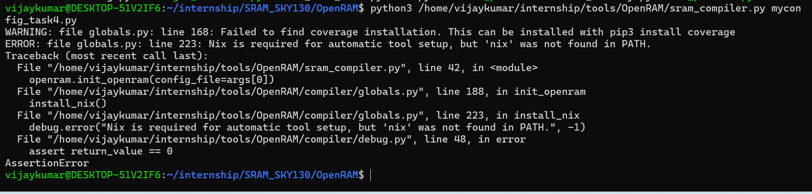
</p>
<p align="center">
  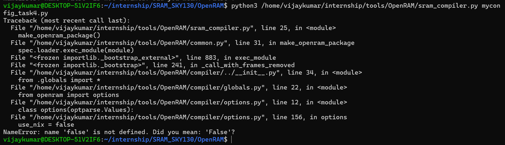
</p>
---

# Issue 2: Technology Module Could Not Load

## Error

```text
ERROR: Could not load tech module
ModuleNotFoundError: No module named 'design_rules'
```

### Why did this happen?

After fixing the Python syntax issue, OpenRAM started loading the SKY130 technology package. However, the technology files were incompatible with the latest OpenRAM release, resulting in missing module dependencies.

---

## Investigation

### Check whether the required file exists

```bash
find ~/internship/SRAM_SKY130/OpenRAM -name "design_rules.py"
```

**Purpose**

Searches the repository for the required technology file.

---

### Inspect the SKY130 directory structure

```bash
tree -L 3 ~/internship/SRAM_SKY130/OpenRAM/sky130A
```

**Purpose**

Displays the technology directory hierarchy to verify whether all expected files are available.

---

### Observation

The technology package lacked helper modules expected by the newer OpenRAM version, such as:

```text
design_rules.py
module_type.py
custom_cell_properties.py
custom_layer_properties.py
```

---

## Fix

Compared the SKY130 technology package with the latest OpenRAM stable release and updated the technology implementation to match the current compiler structure.

---

## Proof
<p align="center">
  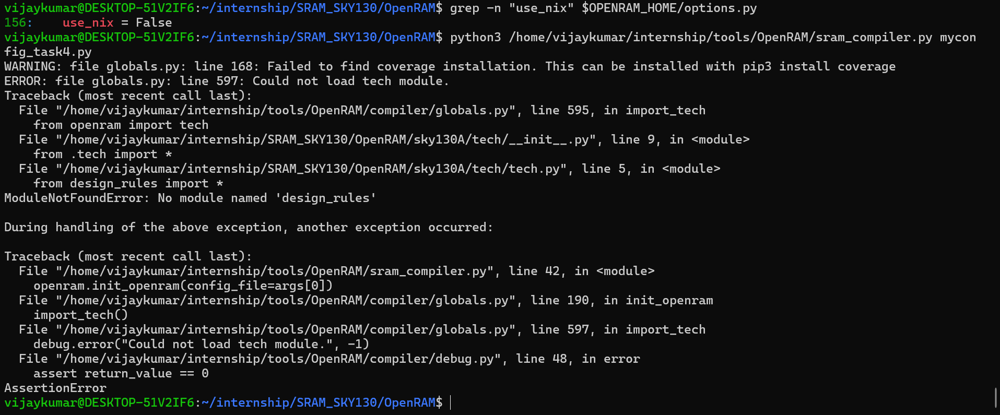
</p>
<p align="center">
  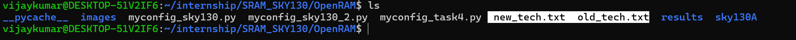
</p>
<p align="center">
  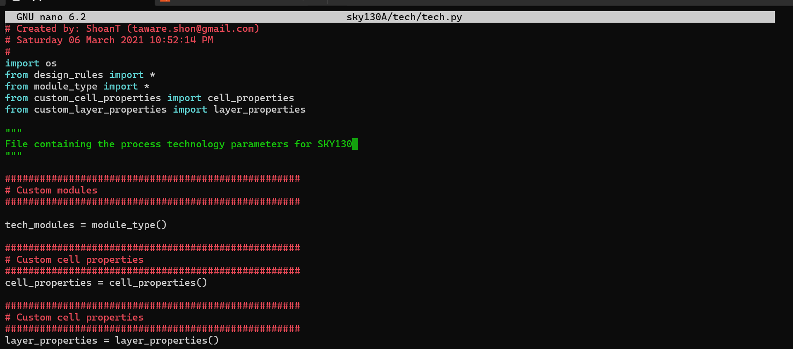
</p>
<p align="center">
  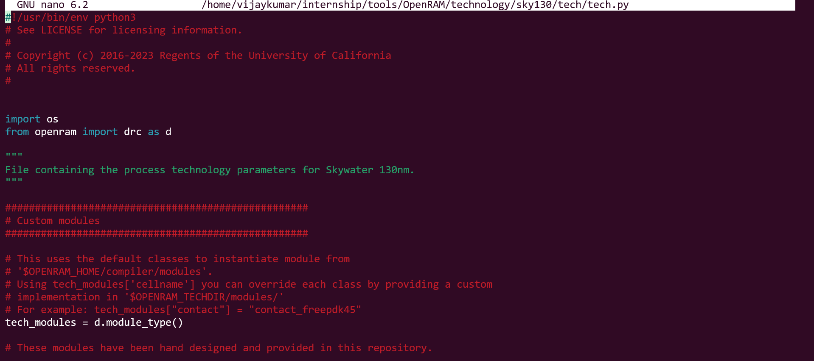
</p>
---

# Issue 3: design_rules Not Defined

## Error

```text
NameError: name 'design_rules' is not defined
```

### Why did this happen?

Although the technology module was now loading successfully, it still used an older OpenRAM API. Several classes had been moved into the `openram.drc` module, making the original import statements invalid.

---

## Investigation

Locate the implementation of `design_rules`.

```bash
grep -R "class design_rules" ~/internship/tools/OpenRAM -n
```

**Purpose**

Finds where the `design_rules` class is implemented inside OpenRAM.

---

## Observation

The class still exists but is now accessed through the OpenRAM DRC module rather than being imported directly.

---

## Fix

Updated the technology file.

Replace

```python
from design_rules import *
from module_type import *
from custom_cell_properties import cell_properties
from custom_layer_properties import layer_properties
```

with the latest OpenRAM API.

```python
from openram import drc as d
```

Also update the following:

```python
tech_modules = d.module_type()

cell_properties = d.cell_properties()

layer_properties = d.layer_properties()
```

---

## Proof

<p align="center">
  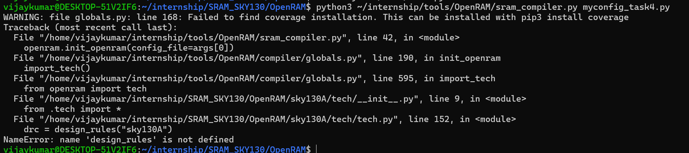
</p>
<p align="center">
  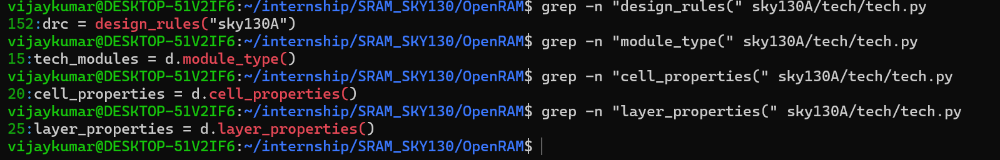
</p>
<p align="center">
  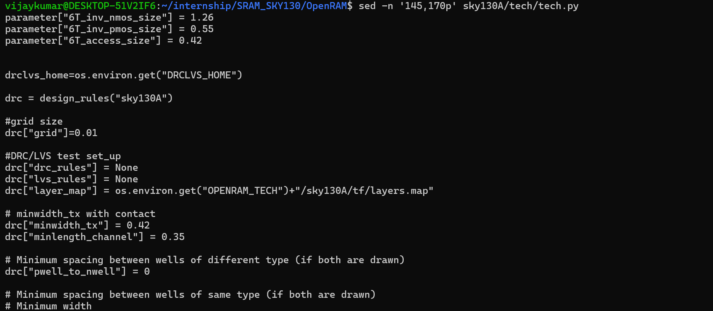
</p>
<p align="center">
  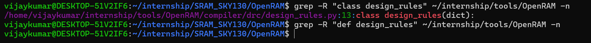
</p>
---

# Issue 4: Missing Python Dependency (Scikit-Learn)

## Error

```text
ModuleNotFoundError: No module named 'sklearn'
```

### Why did this happen?

Once the technology package loaded successfully, OpenRAM entered the characterization stage. The delay modeling module depends on the Scikit-Learn library, which was not installed in the Python environment.

---

## Fix

```bash
pip3 install scikit-learn
```

**Purpose**

Installs the Scikit-Learn package required by the OpenRAM characterization engine.

---

## Proof

> <p align="center">
  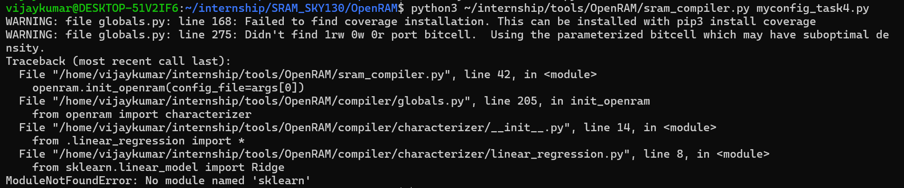
</p>

---

# Issue 5: Successful OpenRAM Initialization

## Result

After resolving the environment and technology compatibility issues, OpenRAM successfully initialized and generated the SRAM design.

Generated files include:

```text
.gds
.sp
.v
.lef
.lib
.log
.html
.py
.lvs
```

---

## Proof

> <p align="center">
  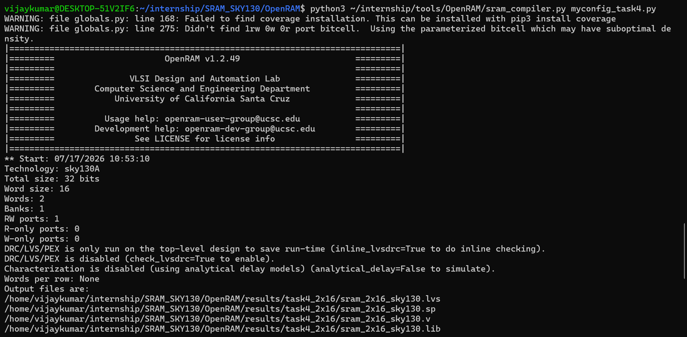
</p>

---

---

# Issue 6: OpenRAM–SKY130 Layout Compatibility (`poly_to_active` / `poly_to_contact`)

## Error

```text
AttributeError: 'pbitcell' object has no attribute 'poly_to_active'
```

### Why did this happen?

After successfully initializing OpenRAM, the SRAM generation failed during the bitcell layout generation stage.

The compiler attempted to access the layout attribute `poly_to_active` while calculating the bitcell spacing. However, due to compatibility differences between the current OpenRAM compiler and the SKY130 technology package, the required DRC attribute was not initialized correctly, resulting in the above error.

---

## Investigation

### Locate all references to `poly_to_active`

```bash
grep -R "poly_to_active" ~/internship/tools/OpenRAM -n
```

**Purpose**

Searches the entire OpenRAM source tree to identify where `poly_to_active` is referenced and how it is expected to be initialized.

---

### Locate all references to `poly_to_contact`

```bash
grep -R "poly_to_contact" ~/internship/tools/OpenRAM -n
```

**Purpose**

Checks whether the compiler uses `poly_to_contact` instead of `poly_to_active` in any part of the layout generation process.

---

### Inspect the DRC constant initialization

```bash
grep -n "setup_drc_constants" ~/internship/tools/OpenRAM/compiler/base/hierarchy_layout.py
```

**Purpose**

Locate the function responsible for generating all layout DRC constants during OpenRAM initialization.

---

### Inspect the constructor hierarchy

```bash
sed -n '1,150p' ~/internship/tools/OpenRAM/compiler/base/design.py
```

```bash
sed -n '1,180p' ~/internship/tools/OpenRAM/compiler/base/hierarchy_design.py
```

```bash
sed -n '1,200p' ~/internship/tools/OpenRAM/compiler/base/hierarchy_layout.py
```

**Purpose**

Verify whether the layout constructor was executed correctly and whether DRC constants were initialized before SRAM generation.

---

### Generate reports for comparison

```bash
grep -R "layout\." ~/internship/tools/OpenRAM/compiler > layout_attrs.txt
```

```bash
grep -R "self\." ~/internship/tools/OpenRAM/compiler > compiler_attrs.txt
```

```bash
grep "drc\[" ~/internship/tools/OpenRAM/technology/sky130A/tech/tech.py > tech_drc.txt
```

**Purpose**

Generate reports to compare:

- SKY130 technology DRC rules
- Layout attributes generated by OpenRAM
- Attributes expected by the compiler

This helped identify any compatibility mismatch.

---

### Add temporary debug statements

Temporary debug statements were added inside:

```text
compiler/base/hierarchy_layout.py
```

to verify whether the required layout attributes were being generated.

---

## Observation

The investigation showed that the SKY130 technology file defines the DRC rule:

```text
poly_to_active
```

while parts of the OpenRAM compiler expect:

```text
poly_to_contact
```

As a result, only one of the required layout attributes was being generated, causing the bitcell layout generation to fail.

The temporary debug output confirmed the issue.

Before the fix:

```text
Has poly_to_active   : False
Has poly_to_contact  : True
```

---

## Fix

Updated:

```text
compiler/base/hierarchy_layout.py
```

Modified the compatibility logic so that both layout attributes are generated from the same SKY130 DRC rule.

```python
value = drc(match.group(0))

setattr(layout, "poly_to_active", value)
setattr(layout, "poly_to_contact", value)
```

This preserves compatibility between the latest OpenRAM compiler and the SKY130 technology package.

---

## Verification

After applying the compatibility patch, the temporary debug statements produced:

```text
Has poly_to_active   : True
Has poly_to_contact  : True
Has active_space     : True

poly_to_active = 0.075
poly_to_contact = 0.075
```

The previous `AttributeError` was completely resolved.

OpenRAM successfully proceeded beyond the bitcell layout generation stage.

---

## Proof

<p align="center">
  
</p>

<p align="center">
  
</p>

<p align="center">
  
</p>

<p align="center">
  
</p>

---
---

# Issue 7: OpenRAM Minimum Supported SRAM Specification

## Error

```text
ERROR:
Minimum number of rows is 16, but given 2.0
```

### Why did this happen?

After resolving all OpenRAM–SKY130 compatibility issues, the compiler successfully entered the SRAM configuration stage.

During SRAM organization, OpenRAM validates whether the requested memory configuration satisfies its internally supported minimum specifications.

Since Task 4 requests a **2-word × 16-bit SRAM**, the generated SRAM organization contains only **2 rows**, whereas the current OpenRAM implementation enforces a minimum supported SRAM organization of **16 rows**.

Therefore, the compiler terminates before SRAM generation begins.

---

## Investigation

### Locate the source of the error

```bash
grep -n "Minimum number of rows" \
~/internship/tools/OpenRAM/compiler/sram_config.py
```

**Purpose**

Locate the section of the OpenRAM compiler responsible for validating the SRAM organization.

---

### Inspect the validation logic

```bash
sed -n '160,190p' \
~/internship/tools/OpenRAM/compiler/sram_config.py
```

**Purpose**

Inspect how OpenRAM calculates the number of rows and identify the minimum supported specification.

---

### Verify the requested SRAM configuration

```bash
cat myconfig_task4.py
```

**Purpose**

Confirm that the requested SRAM configuration matches the Task 4 requirements.

Configuration used:

```python
word_size = 16
num_words = 2
num_banks = 1
```

---

## Observation

The following validation was identified inside:

```text
compiler/sram_config.py
```

```python
if (not OPTS.is_unit_test and tentative_num_rows < 16):
```

followed by

```python
debug.check(
    tentative_num_rows * words_per_row >= 16,
    "Minimum number of rows is 16..."
)
```

This confirms that the limitation originates from the OpenRAM compiler itself.

It is **not** related to the SKY130 technology package or the compatibility fixes implemented earlier.

Instead, it represents the **minimum SRAM specification currently supported by OpenRAM**.

---

## Current Status

The OpenRAM–SKY130 compatibility issues have been successfully resolved.

The remaining limitation corresponds to the minimum SRAM specification supported by the current OpenRAM implementation.

This behavior has been confirmed during discussion with the project mentor and has been documented as an OpenRAM design constraint rather than a compiler or technology compatibility issue.

---

## Proof

<p align="center">
  
</p>

<p align="center">
  
</p>

---

---

# Issue 8: AI-Assisted Technology Migration to Resolve OpenRAM–SKY130 API Compatibility

## Problem

After resolving multiple OpenRAM–SKY130 compatibility issues, additional API-related failures continued to appear during SRAM generation.

Previously encountered compatibility errors included:

```text
AttributeError: 'pbitcell' object has no attribute 'poly_to_active'

ImportError:
cannot import name 'lef_rom_interconnect'

Missing module_type

Missing cell_properties

Missing layer_properties
```

---

## Why did this happen?

Although each compatibility issue could be individually patched, a detailed investigation revealed that the failures were not isolated bugs.

The legacy **SKY130A technology package** and the latest **OpenRAM stable compiler** belong to different OpenRAM API generations.

The legacy technology package was originally developed using an older compiler architecture, while the latest OpenRAM release expects:

- Updated technology initialization
- Modern DRC APIs
- OpenPDKs integration
- New technology modules
- Updated custom bitcell wrappers

Therefore, continuing to patch individual compatibility issues was unlikely to provide a stable long-term solution.

Instead, an AI-assisted migration strategy was adopted.

---

# Investigation

## Compare both technology packages

```bash
diff -rq \
~/internship/tools/OpenRAM/technology/sky130 \
~/internship/SRAM_SKY130/OpenRAM/sky130A
```

**Purpose**

Compare the native OpenRAM SKY130 technology package with the legacy SKY130A package and identify architectural differences.

---

## Compare directory structures

```bash
tree -L 2 \
~/internship/tools/OpenRAM/technology/sky130
```

```bash
tree -L 2 \
~/internship/SRAM_SKY130/OpenRAM/sky130A
```

**Purpose**

Inspect both technology packages and compare their directory organization.

---

## Observation

The comparison revealed that the latest OpenRAM SKY130 technology package uses a modern architecture consisting of:

```text
custom/
tech/
```

whereas the legacy SKY130A package provides:

```text
gds_lib/
mag_lib/
sp_lib/
models/
tf/
tech/
```

This confirmed that both technology packages belong to different OpenRAM generations.

Rather than continuing to patch the legacy technology, the native OpenRAM SKY130 technology was selected as the new foundation.

---

# AI-Assisted Migration Strategy

Instead of modifying the legacy technology package, the latest OpenRAM SKY130 technology was preserved while importing only the required SRAM library assets from the legacy SKY130A package.

This minimizes compiler compatibility issues while preserving the custom SRAM library cells.

---

# Migration Procedure

## Step 1 — Backup the native technology

```bash
cd ~/internship/tools/OpenRAM/technology

cp -r sky130 sky130_merge

cp -r sky130 sky130_original_backup
```

**Purpose**

Create a new technology package for experimentation without modifying the original OpenRAM SKY130 technology.

---

## Step 2 — Import SRAM library assets

```bash
cp -r ~/internship/SRAM_SKY130/OpenRAM/sky130A/gds_lib \
~/internship/tools/OpenRAM/technology/sky130_merge/

cp -r ~/internship/SRAM_SKY130/OpenRAM/sky130A/sp_lib \
~/internship/tools/OpenRAM/technology/sky130_merge/

cp -r ~/internship/SRAM_SKY130/OpenRAM/sky130A/mag_lib \
~/internship/tools/OpenRAM/technology/sky130_merge/

cp -r ~/internship/SRAM_SKY130/OpenRAM/sky130A/models \
~/internship/tools/OpenRAM/technology/sky130_merge/

cp -r ~/internship/SRAM_SKY130/OpenRAM/sky130A/tf \
~/internship/tools/OpenRAM/technology/sky130_merge/
```

**Purpose**

Import the legacy SRAM technology assets while preserving the latest OpenRAM technology implementation.

---

## Step 3 — Update the SRAM configuration

Replace

```python
tech_name = "sky130A"
```

with

```python
tech_name = "sky130_merge"
```

**Purpose**

Configure OpenRAM to use the migrated technology package.

---

## Step 4 — Configure the OpenPDKs environment

During the first execution, OpenRAM reported:

```text
SystemError:
Unable to find open_pdks tech file.
Set PDK_ROOT.
```

The required OpenPDKs installation was located and the environment variable was configured.

```bash
export PDK_ROOT=/home/vijaykumar/pdk/open_pdks/sky130
```

**Purpose**

Allow the native SKY130 technology package to locate Magic, Netgen, and transistor model files required by OpenRAM.

---

# Verification

After completing the migration, OpenRAM successfully progressed through the following stages:

- Technology initialization
- OpenPDKs detection
- DRC constant initialization
- SRAM configuration generation
- Bitcell factory initialization
- Custom SKY130 bitcell loading

The previously encountered API compatibility issues were no longer observed.

The runtime debug output confirmed:

```text
Technology: sky130_merge

Has poly_to_active   : True
Has poly_to_contact  : True
Has active_space     : True

poly_to_active = 0.075
poly_to_contact = 0.075
```

This demonstrates that the migrated technology package successfully initialized using the latest OpenRAM compiler.

---

# Current Blocking Issue

The compiler now proceeds beyond technology initialization and reaches the custom SRAM library integration stage.

The remaining error is:

```text
ERROR:
Custom cell pin names do not match spice file

Expected:

['BL', 'BR', 'VGND', 'VPWR', 'VPB', 'VNB', 'WL']

Detected:

[]
```

Unlike previous failures, this error is no longer related to technology compatibility.

Instead, it indicates that OpenRAM successfully loads the migrated technology package but is unable to extract the expected pin definitions from the imported legacy SPICE library.

This confirms that the remaining work is focused on **custom library integration** rather than **OpenRAM–SKY130 API compatibility**.

---

# Updated Debugging Summary

| Issue | Root Cause | Resolution | Status |
|--------|------------|------------|--------|
| Invalid Python Boolean | Incorrect Python boolean keyword (`false`) | Changed to `False` | ✅ Fixed |
| Technology Module Loading Failure | Legacy SKY130 technology package incompatible with latest OpenRAM structure | Updated technology files and resolved missing dependencies | ✅ Fixed |
| `design_rules` Not Defined | Legacy OpenRAM API used obsolete technology imports | Migrated to the latest `openram.drc` API | ✅ Fixed |
| Missing `sklearn` Dependency | Scikit-Learn library required for characterization was not installed | Installed Scikit-Learn using `pip3` | ✅ Fixed |
| OpenRAM Initialization | Environment validation and compiler setup | OpenRAM initialized successfully | ✅ Fixed |
| `poly_to_active` / `poly_to_contact` Compatibility | DRC attribute mismatch between the latest OpenRAM compiler and the legacy SKY130 technology package | Implemented a compatibility layer inside `hierarchy_layout.py` | ✅ Fixed |
| Minimum Supported SRAM Specification | OpenRAM enforces a minimum SRAM organization of **16 rows** | Confirmed as an OpenRAM design limitation and documented after mentor verification | ✅ Documented |
| OpenRAM–SKY130 API Compatibility | Legacy `sky130A` technology package belongs to an older OpenRAM API generation | Performed AI-assisted migration using the native OpenRAM SKY130 technology while preserving the legacy SRAM library assets | ✅ Completed |
| OpenPDKs Environment Configuration | Native SKY130 technology requires an external OpenPDKs installation (`PDK_ROOT`) | Configured the required OpenPDKs environment variables | ✅ Fixed |
| Custom SRAM Library Integration | Legacy SRAM SPICE library pin definitions are not recognized by the latest custom bitcell wrapper | Investigation in progress to align legacy library cells with the modern OpenRAM bitcell interface | ⏳ Under Investigation |